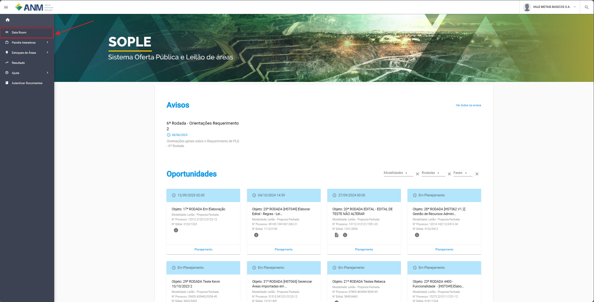

O que são os arvquivos do Data Room?
====================================
São documentos extraídos dos processos minerários e/ou as Fichas Técnicas (conjunto de informações geológicas referentes à área do direito minerário, elaboradas com dados do Serviço Geológico do Brasil – SGB/CPRM e ANM), e outras informações relativas a cada área que poderão ser disponibilizados pela ANM, para fins de consulta meramente informativa, em meio digital, em endereço eletrônico a ser disponibilizado na seção de documentos da rodada na Plataforma SOPLE  (https://
sople.anm.gov.br) a partir da data de publicação do Edital.

Todos os documentos são de domínio público e pode ser acessados a qualquer momento.

