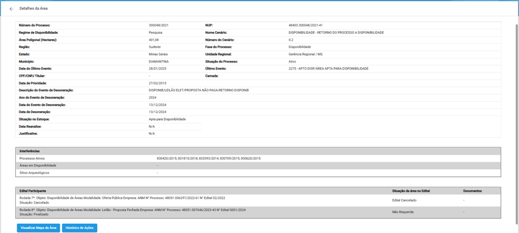
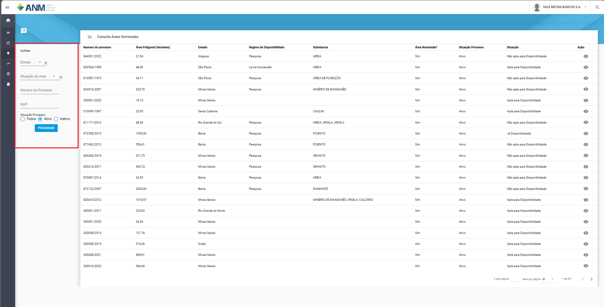
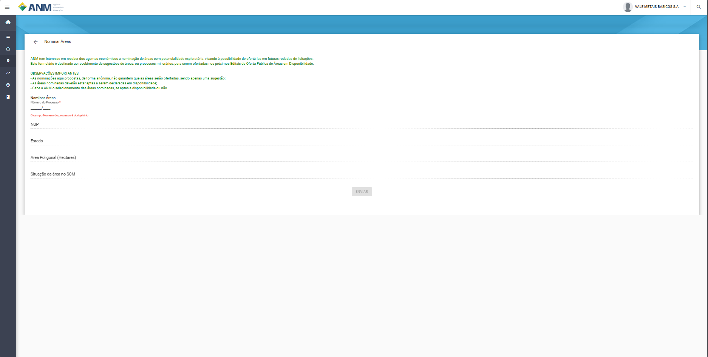
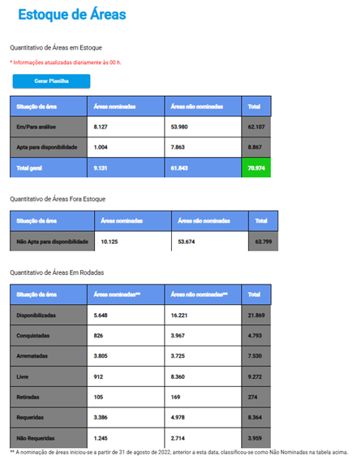
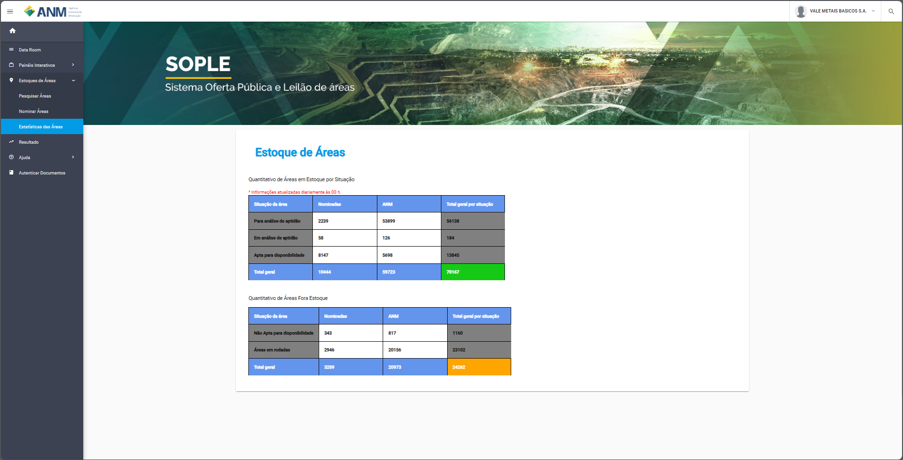

Informações gerais dos Processos
================================
Nesta seção são apresentadas informações gerais sobre os Processos (e suas respectivas áreas) presentes na base de dados do SOPLE.

    1) Por rotina automatizada de pesquisa, que busca, a partir das informações e eventos dispostos no Sistema de Cadastro Mineiro (SCM), Processos que se enquadrem em situação (cenário) onde é prevista a inserção da área em Edital de Disponibilidade.
    2) Via nominação de área (maiores informações na seção “Nominar Áreas” abaixo).

É necessário ressaltar **que o fato do Processo constar no Estoque de Áreas do SOPLE não pressupõe que sua área será inserida em Edital de Disponibilidade**.
A decisão sobre a real viabilidade da disponibilidade da área depende de análise do corpo técnico da ANM,
a partir da verificação, caso a caso, da instrução do Processo e da condição de sua poligonal (maiores informações detalhadas abaixo).

Na tela principal do Estoque de Áreas (módulo “Pesquisar Áreas”) são apresentados os Processos constantes na base do SOPLE e suas informações gerais. São elas:

- Número do processo: número reduzido (formato XXX.XXX/AAAA) do Processo ANM.

- Estado: Unidade da Federação na qual o Processo foi originado.

- Município: Município onde incide a poligonal minerária

- Área (ha): área total, em hectares, do Processo. Caso o Processo tenha mais de uma poligonal remanescente a ele atrelada, é indicado neste campo a soma das áreas de todas elas.

- Substância: relação de substâncias atreladas aos Processos. Esta informação pode não estar presente em todos os Processos.

- Regime de Disponibilidade: regime identificado para qual a área do Processo será/foi destinada em Edital de Disponibilidade. São três os regimes possíveis de Disponibilidade, estipulados no Art. 3º da Resolução ANM Nº 24, de 3 de fevereiro de 2020: pesquisa, lavra (PLG) e lavra (concessão). Uma vez que, em alguns casos, a determinação do regime de disponibilidade é indicada no momento da depuração da área pela equipe técnica da ANM, esta informação pode não estar presente em todos os Processos.

- Área nominada?: indica se o Processo foi objeto de nominação ou não (maiores informações na seção “Nominar Áreas” abaixo).

- Situação Processo: indica se o Processo está ativo ou inativo no Sistema de Cadastro Mineiro (SCM).

- Situação no Estoque: Indica a situação do Processo no SOPLE. São quatro as possibilidades:
    1. **Para análise**: situação padrão de todas as áreas ainda não depuradas, inseridas na base do Estoque de Áreas via rotina automática.
    2. **Em análise**: situação padrão de todas as áreas nominadas (ou seja, objeto de manifestação de interesse por terceiros) ainda não depuradas constantes na base do Estoque de Áreas.
    3. **Apta para disponibilidade**: situação que indica que o Processo passou por depuração técnica, que concluiu que ele atende às condições mínimas para integrar futura Rodada de Disponibilidade. Esta situação é essencial para que o Processo seja inserido em Rodada de Disponibilidade (ou seja, Processos que não se encontram em situação “Apta para disponibilidade” não podem participar de Rodadas).
    4. **Não apta para disponibilidade**: situação que indica que o Processo passou por depuração técnica que concluiu que ele apresenta alguma deficiência técnica (falta de previsão legal, instrução documental deficitária ou condição espacial adversa) que o impede de ser inserido em Rodada de Disponibilidade.

- Já disponibilizada em Edital: indica se a área já foi (ou não) inserida em Rodada de Disponibilidade anterior

- Última situação em Edital:  indicação do destino da área na última Rodada de Disponibilidade que ela tenha participado (indicação “sim” na coluna “Já disponibilizada em Edital”). São 11 as possibilidades:

1.	Em Edital: condição das áreas pertencentes a Rodada de Disponibilidade em curso (ainda em prazo de manifestação de interesse ou etapa anterior);
2.	Conquistada: área conquistada a partir de manifestação única de interesse em etapa de Oferta Pública; não se computam, aqui, as áreas que já passaram por etapa de requerimento
3.	Aguardando Leilão: área objeto de mais de uma manifestação de interesse em etapa de Oferta Pública e que ainda não passou por etapa de Leilão
4.	Arrematada: área conquistada em etapa de Leilão; não se computam, aqui, as áreas que já passaram por etapa de requerimento
5.	Requerido: área conquistada/arrematada que já foi objeto de requerimento, após a homologação do resultado final da Rodada;
6.	Sem lance: áreas que participaram de etapa de Leilão mas não tiveram proposta de lance
7.	Livre: área que, via de regra, não foi objetivo de manifestação de interesse em etapa de Oferta Pública ou que não foram objeto de lances em etapa de Leilão; pode contemplar, também, áreas que se tornaram livres por eventuais previsões diversas expressas em Edital;
8.	Retirada: área retirada da Rodada;
9.	Suspensa: área cuja procedimento de disponibilidade foi suspenso;
10.	Removida: área removida de Rodada ainda em fase de planejamento (quando já houve a publicidade da lista, mas ainda não foi aberto o prazo para manifestação de interesse)
11.	Não requerida: área conquistada/arrematada que não foi objeto de requerimento

- Ação: contém ícone que permite a expansão de card com maiores detalhes sobre um Processo específico. Ao acessar esta opção, é exibido um card (ver exemplo abaixo) específico sobre a área em questão, que contempla, além das informações já detalhadas anteriormente, diversas informações extraídas do histórico do respectivo Processo no Sistema de Cadastro Mineiro (SCM) e algumas outras. Ressaltamos as seguintes:

1.	Nome cenário: situações de desoneração nas quais são previstas a disponibilidade da área do Processo, estipuladas no Art. 2º da Resolução ANM Nº 24, de 3 de fevereiro de 2020
2.	Justificativa e Data de reanálise: informações específicas que somente são apresentadas para áreas que foram objetos de depuração e tiveram sua situação no SOPLE definida como “Não apta para disponibilidade”. O campo “justificativa” refere-se ao motivo pelo qual a área foi considerada como inapta, enquanto o campo “Data de reanálise” indica a data em que o respectivo Processo terá sua situação retornada para “Em análise”, para ser oportunamente objeto de nova verificação de aptidão.
3.	Interferências: quadro que demonstra as interferências observadas entre a área com outras (poligonais minerárias e áreas de uso especial) constantes na base georreferenciada da ANM
4.	Edital participante: quadro apresentado somente para os Processos já incluídos em Rodadas de Disponibilidade realizadas por meio da plataforma SOPLE. Indica as informações gerais do(s) Edital(s) que contemplou(aram) o a área, bem como qual foi seu destino neste(s) Edital(is).
5.	Botão “Visualizar Mapa da Área”: habilita mapa com a localização da poligonal minerária em justaposição à imagem de satélite
6.	Botão “Histórico de Ações”: habilita o histórico de atualização de informações da área no Banco do Estoque do SOPLE

Pesquisar Áreas
===============
Recurso disponibilizado ao público para que qualquer pessoa possa ver o Estoque de Áreas do SOPLE e buscar a situação específica de um Processo ou de um grupo deles.

O módulo de pesquisa é acessível a partir do canto esquerdo da tela (ver figura abaixo) são disponibilizados os filtros de:

    - **Estado:** possibilita a busca de Processos a partir da Unidade da Federação nos quais estes foram gerados.
    - **Situação da Área:** permite a busca de Processos a partir de sua situação de aptidão do SOPLE (para maiores detalhes, ver seção “Informações gerais dos Processos”).
    - **Número do Processo:** campo utilizado para a pesquisa de um Processo específico, no formato reduzido (formato XXX.XXX/AAAA) no Estoque de Áreas do SOPLE.
    - **NUP:** mesma funcionalidade do campo “Numero do Processo”, mas que pede como entrada o número completo do Processo ANM (formato XXXXX.XXXXXX/AAAA-DV).
    - **Situação Processo:** permite a busca de Processos a partir de sua situação (ativo/inativo) no Sistema de Cadastro Mineiro (SCM).

**Link para acesso:** `Pesquisar Áreas <https://sople.anm.gov.br/portalpublico/areas-nominadas/pesquisar>`_

Nominar Áreas
=============

Ferramenta disponibilizada para que os usuários indiquem à ANM as áreas de Processos que sejam de seu interesse, com o objetivo de inseri-los em futuros Editais de Disponibilidade. Este procedimento se denomina como “Nominação de Áreas”.

Para nominar um Processo basta inserir seu número em formato reduzido (XXX.XXX/AAAA) no campo “Número do Processo”; as demais informações são recuperadas, de forma automática, do Sistema de Cadastro Mineiro (SCM).

**Link para acesso:** `Nominar Áreas <https://sople.anm.gov.br/portalpublico/areas-nominadas/nova>`_

**OBSERVAÇÕES IMPORTANTES:**

    • As nominações de áreas ocorrem sempre de forma anônima (não é solicitado/registrado o interessado pela indicação).
    • Considera-se, para todos os efeitos, que as nominações de Processos são somente sugestões – ou seja, não é garantia que suas respectivas áreas serão ofertadas.
    • Os Processos nominados serão objeto de depuração para verificação da real aptidão à oferta de suas áreas em Rodadas de Disponibilidade.
    • Compete à ANM a seleção das áreas aptas para serem disponibilizadas nos próximos editais.

Estatísticas de Áreas
======================
Recurso que aponta a quantidade de áreas dentro e fora do Estoque do SOPLE por Situação.

A primeira tabela **(Quantitativo de Áreas em Estoque por Situação)** apresenta número de Processos contantes no Estoque de Áreas do SOPLE cujas áreas encontram-se nas situações “para análise de aptidão”, “em análise de aptidão” e “apta para disponibilidade”. Esta tabela apresenta o quantitativo de Processos que possuem, em maior ou menor grau, potencial de serem inseridos em Rodada de Disponibilidade. Ressalte-se, em tempo, que os Processos já depurados e considerados em condições ideais de terem suas áreas ofertadas estão sintetizados na linha “apta para disponibilidade”.

A última tabela (Quantitativo de Áreas Em Rodadas) contempla o quantitativo total de áreas inseridas em Editais passados (linha “Disponibilizadas”) bem como alguns dos desdobramentos possíveis – caso o Edital já esteja finalizado – para estas áreas:

•  “Conquistadas”: refere-se ao montante de áreas conquistadas em Oferta Pública (manifestação pública) ou na Avaliação Social (6ª Rodada). 
•  “Arrematadas”: quantitativo de áreas arrematadas em Leilão (disputa de lances).
•  “Livre”: quantidade de áreas disponibilizadas em Editais sem nenhuma manifestação de interesse ou sem lance.
•  “Retiradas”: áreas inseridas em Editais, mas retiradas do certame
•  “Requeridas”: quantitativo de áreas conquistadas e arrematadas que foram objeto de novos Requerimentos.
•  “Não requeridas”: quantitativo de áreas conquistadas e arrematadas que não foram objeto de novos Requerimentos.

Em ambas as tabelas a coluna “Nominadas” apresenta o quantitativo de Processos (e suas respectivas situações) que foram objetos de indicações de interesse (nominações) por usuários externos, enquanto a coluna “ANM” apresenta o quantitativo de Processos inseridos na base do Estoque de Áreas a partir de rotina automatizada de pesquisa, via dados do Sistema de Cadastro Mineiro (SCM). São informações excludentes, ou seja, se um Processo foi objeto de nominação é contabilizado somente na coluna “Nominadas”, não sendo contado na coluna “ANM”.

Maiores informações sobre os procedimentos de inclusão do Processo no Estoque de Áreas do SOPLE e de depuração estão disponíveis na seção “Informações gerais dos Processos”, acima.

**Link para acesso:** `Estatísticas das Áreas <https://sople.anm.gov.br/portalpublico/estatisticas-areas>`_
