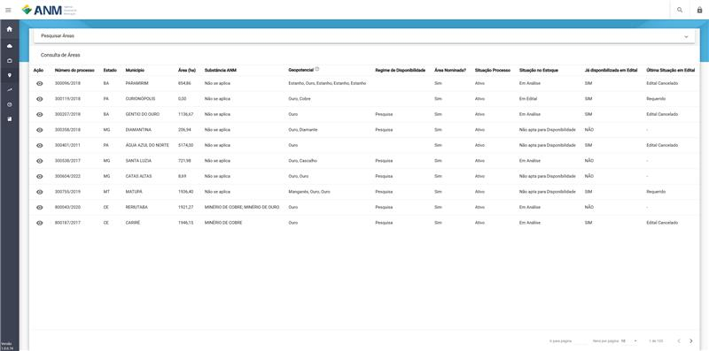

Pesquisar Áreas
===============
Recurso diponibilitado de forma pública para que qualquer possoa possa ver o estoque de áreas e a situação em que a área se encontra.

Na tela são disponilizados os filtros de :
 - Estádo
 - Situação da Área
 - Número do Processo
 - NUP
 - Situação Processo

Nominar Áreas
=============
No recurso o minerador informa o **Número do Processo** ao qual tem interesse e está área terá maior prioridade conforme a quantidade de interessados.

Estátisticas das Áreas
======================
Recurso que aponta a quantidade de áreas dentro e fora do Estoque do SOPLE por Situação.

.. image:: ../imagens/1.4Estoque.png