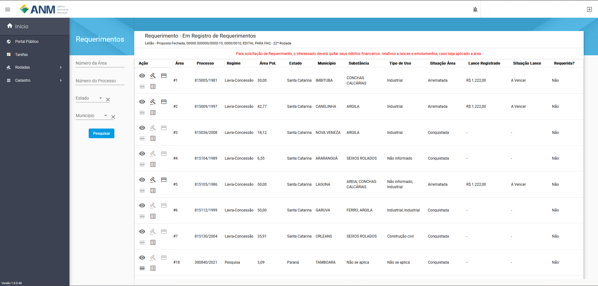
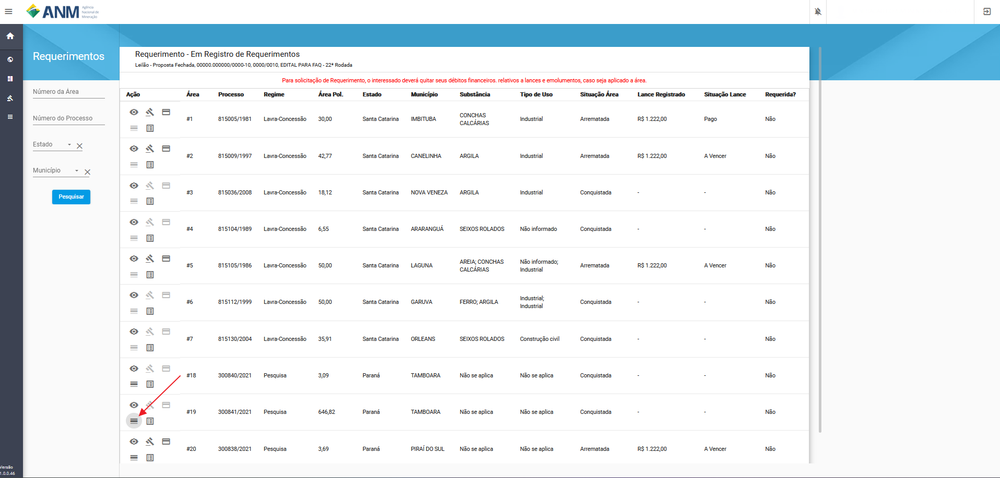
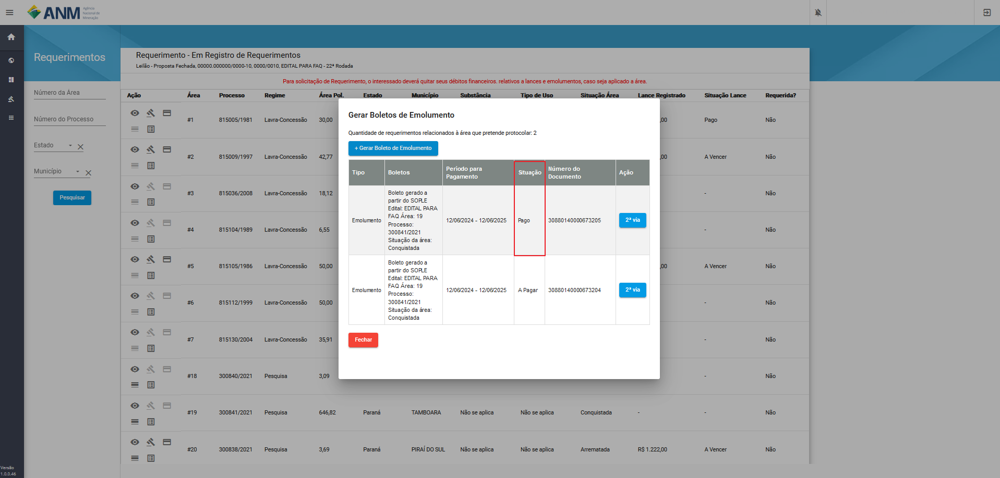

Como realizar o pagamento dos Lances e Emolumentos?
===================================================

Fase de pagamento é realizada pelos usuários após o fim da fase de Homologação e Adjudicação, onde ficará habilitado para a geração conforme a situação da área.

O pagamento fica junto ao Requerimento de áreas tendo seu acesso através:

**Portal Público:**

    Acessando os Detalhes do Edital, card de Requerimento em Listar áreas Conquistadas e/ou Arrematadas.

    .. image:: ../imagens/10.RequerimentoPortalPublico.png

**Painel do Minerador:**

    Acessando em Portal do Minerador, Rodadas, Requerimentos, Edital em Requerimento.

    .. image:: ../imagens/10.TelaRequerimentoPainel.png

**Observação:** Em ambas as opções a possibilidade de fazer o pagamento de Lance e Emolumentos fica atrelada à fase do edital, que deve estar na situação **"Em Registro de Requerimentos"**.

Página de Requerimentos:

Filtros

    - **Número da Área:** campo utilizado para pesquisa de uma área pelo seu identificador no edital.
    - **Número do Processo:** campo utilizado para pesquisa de um Processo específico, no formato reduzido (formato XXX.XXX/AAAA) no Estoque de Áreas do SOPLE.
    - **Estado:** possibilita a busca de Processos a partir da Unidade da Federação nos quais estes foram gerados.
    - **Município:** possibilita a busca de Processos a partir dos municípios da Unidade da Federação selecionada anteriormente.

Pagamento de Lance
##################

    Para cada área que se encontra na situação "Arrematada", é habilitado o ícone (:fa:`fa-solid fa-credit-card`) "Gerar Boleto Lance", que abre uma tela com o boleto para impressão.

    .. image:: ../imagens/10.RequerimentoBotaoBoleto.png

    O sistema vai abrir uma tela para impressão do boleto, através do botão "Gerar".

    .. image:: ../imagens/10.GerarBoleto.png

    Esse boleto deve ser guardado pelo usuário, pois não existe uma segunda via, caso tenha perdido, clique em **+ Gerar Novo Boleto** para ter um novo boleto.

    .. image:: ../imagens/10.GerarNovoBoletoPagamento.png

    Ao realizar o pagamento o sistema pode levar até 5 dias úteis para a compensação do mesmo, assim que for compensado o valor a situação do Boleto passa para **Pago**.

    .. image:: ../imagens/10.BoletoPago.png
   

Pagamento de Emolumento
#######################

Modelo de pagamento para áreas que são do **Regime de Pesquisa**, é habilitado o ícone "Gerar Emolumentos".

O sistema abrirá uma tela com o botão + Gerar Boleto de Emolumento e a lista de emolumentos já criados. Ao clicar em Gerar Boleto de Emolumento, um novo boleto é criado, lembrando que para requerer a área em partes é necessário pagar um emolumento por parte.

.. image:: ../imagens/10.GerarNovoEmolumento.png

Caso precise baixar novamente o emolumento gerado em "Gerar Emolumentos", será possível imprimir uma segunda via.

Ao realizar o pagamento o sistema pode levar até 3 dias úteis para a compensação do mesmo, assim que for compensado o valor a situação do Emolumento passa para **Pago**.

Perguntas Frequentes
####################

1 - Fui gerar meu boleto de lance e uma tela para preencher o endereço apareceu, o que fazer?
*********************************************************************************************
    Para alguns usuários que não tem todos os dados cadastrais no sistema de Arrecadação, será apresentada a tela:

        .. image:: ../imagens/10.TelaEnderecoImpressaoBoleto.png
    
    Caso seja apresentada, preencha corretamente os dados de endereço e clique em **Enviar** e o boleto será gerado.

2 - Realizei o(s) pagamento(s) integral(is) do(s) valor(es) da proposta financeira vencedora e/ou do emolumento mas não habilitou o requerimento. O que fazer?
**************************************************************************************************************************************************************
    O participante deverá encaminhar para o e-mail **sople@anm.gov.br** um print demonstrando o fato acompanhado das informações de login utilizadas como nome do Usuário no SOPLE e CPF/CNPJ da pessoa/empresa sendo representadas.

3 - Não tenho o cadastro no Sistema de Dados Cadastrais - SDC para gerar o boleto de Emolumento, o que fazer?
*************************************************************************************************************
    Existe no site na ANM um passo a passo do cadastro no **Sistema de Dados Cadastrais - SDC**, siga as orientações e após o cadastro faça um novo acesso ao SOPLE.

    **Como Realizar o Cadastro** no link: https://www.gov.br/anm/pt-br/assuntos/exploracao-mineral/Cadastro-para-Requerimentos/como-realizar-o-cadastro
