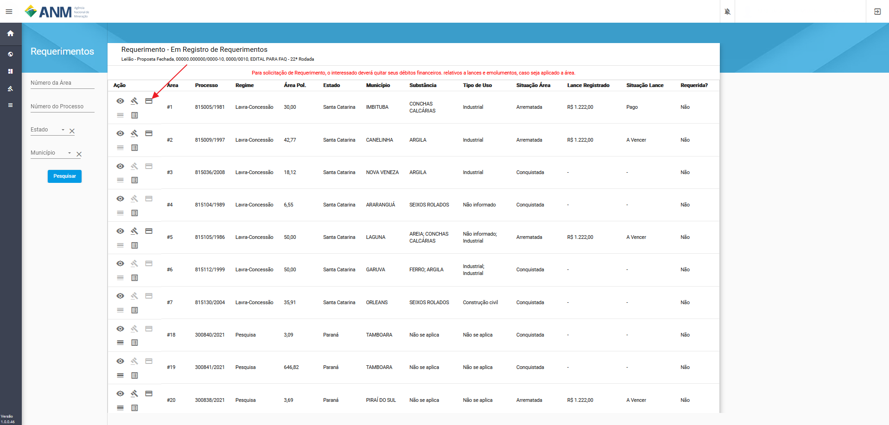
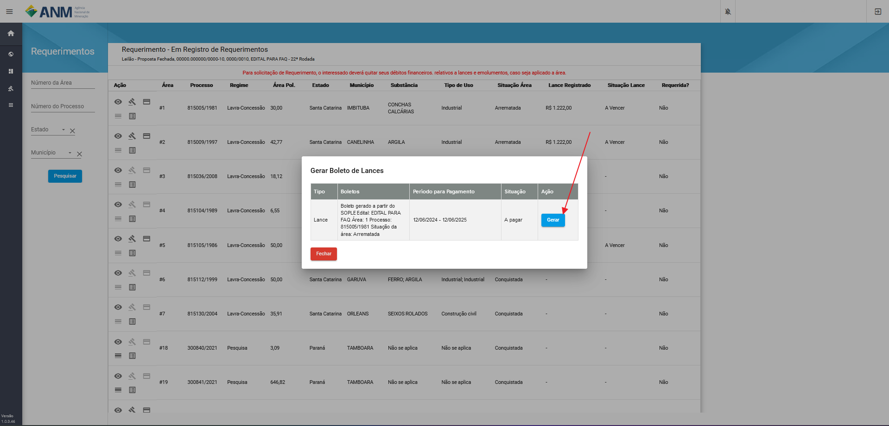
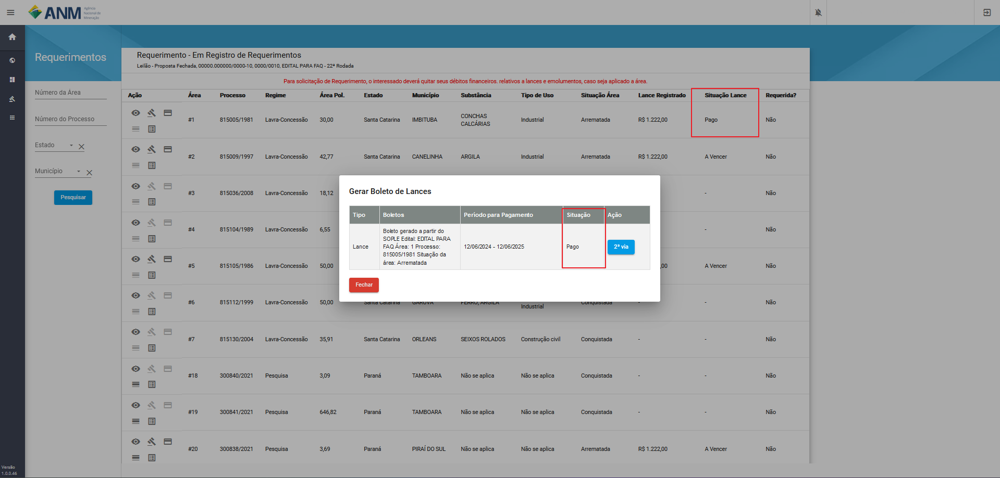
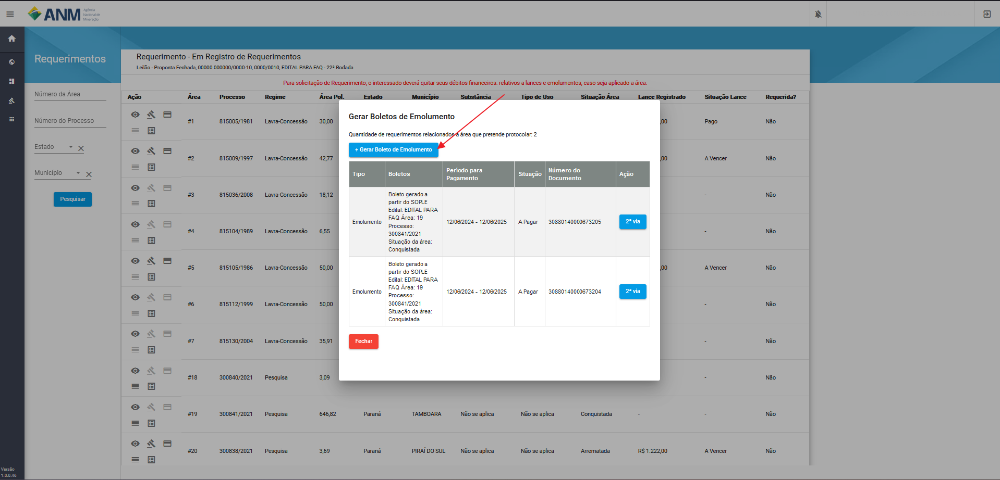

Como realizar o pagamento dos Lances e Emolumentos?
===================================================

Fase de pagamento é realizada pelos usuários após ao fim da fase de Homologação e Adjudicação, onde o ficará habilitado o para a geração conforme a situação da área.

O pagamento fica junto ao Requerimento de áreas tendo seu acesso através:

**Portal Público:**

    Acessando os Detalhes do Edital, card de Requerimento em Listar áreas Conquistadas e/ou Arrematadas.

    .. image:: ../imagens/10.RequerimentoPortalPublico.png

**Painel do Minerador:**

    Acessando em Protal do Minerador, Rodadas, Requerimentos, Edital em Requerimento.

    .. image:: ../imagens/10.TelaRequerimentoPainel.png

**Observação:** Em ambas as opções a possibilidade de fazer o pagamento de Lance e Emolumentos fica atrelada a fase do edital, que deve estar na situação **"Em Registro de Requerimentos"**.

Página de Requerimentos:

.. image:: ../imagens/10.TelaRequerimentoUsario.png

Filtros

    - **Número da Área:** campo utilizado para pesquisa de uma área pelo seu identificador no edital.
    - **Número do Processo:** campo utilizado para pesquisa de um Processo específico, no formato reduzido (formato XXX.XXX/AAAA) no Estoque de Áreas do SOPLE.
    - **Estado:** possibilita a busca de Processos a partir da Unidade da Federação nos quais estes foram gerados.
    - **Município:** possibilita a busca de Processos a partir dos municípios da Unidade da Federação selecionada anteriormente.

Pagamento de Lance
##################

Para cada área que se encontra na situação "Arrematada", é habilitado o ícone (:fa:`fa-solid fa-credit-card`) "Gerar Boleto Lance", que abre uma tela com o boleto para impressão.

O sistema vai abrir uma tela para impressão do boleto, através do botão "Gerar".

Caso precise baixar novamente o boleto, ao acessar o botão (:fa:`fa-solid fa-credit-card`) "Gerar Boleto Lance", será possível imprimir uma segunda via.

Ao realizar o pagamento o sistema pode levar até 3 dias úteis para a compensação do mesmo, assim que for compensado o valor a situação do Boleto passa para **Pago**.

Pagamento de Emolumento
#######################

Modelo de pagamento para áreas que são do **Regime de Pesquisa**, é habilitado o ícone "Gerar Emolumentos".

.. image:: ../imagens/10.GerarEmolumento.png

O sistema abrirá uma tela com o botão + Gerar Boleto de Emolumento e a lista de emolumentos já criados. Ao clicar em Gerar Boleto de Emolumento, um novo boleto é criado, lembrando que para requerer a área em partes é necessário pagar um emolumento por parte.

Caso precise baixar novamente o emolumento gerado em "Gerar Emolumentos", será possível imprimir uma segunda via.

.. image:: ../imagens/10.SegundaViaEmolumento.png 

Ao realizar o pagamento o sistema pode levar até 3 dias úteis para a compensação do mesmo, assim que for compensado o valor a situação do Emolumento passa para **Pago**.

.. image:: ../imagens/10.EmolumentoPago.png