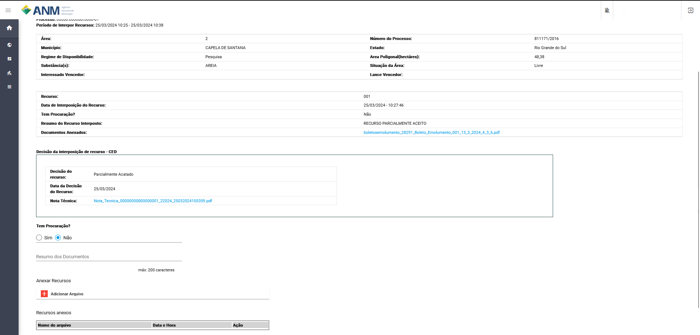

Interpor Recursos Administrativos
=================================
Este recurso permite as pessoas que estão participando ou não do edital a abrir recursos, para o questionamento de qualquer área do sistema dentro do período definido.
O recurso é análisado em três momentos, CED, SOD e DIRC, podendo ser acatado, rejeitado ou parciamente acatado conforme os documentos de alegação incluidos no recurso.

Rotas de Acesso aos Recursos Administrativos
============================================

Portal Público
##############
A partir dos detalhes do edital, no card Recursos Administrativos, no link Interpor Recursos Administrativos.
Lembrando que somente é possível fazer este procedimento durante o Período de Interpor Recursos, que não é o tempo total estipulado no card.

.. image:: ../imagens/11.AcessoPortalRecursoAdministrativo.png

Portal do Minerador
###################
Acessado através do menu Rodadas, Recursos Administrativos, no qual será possível o usuário selecionar o edital referente a(s) área(s) que deseja realizar o(s) recurso(s).

.. image:: ../imagens/11.AcessoPainelRecursoAdministrativo.png

Filtros e Ações para Interposição de Recurso
############################################

Para a identificação das áreas os sistema disponibiliza os seguintes campos de pesquisa:

    - **Número da Área:** campo que corresponde o número da área dentro do edital.
    - **Número do Processo:** campo utilizado para pesquisa de um Processo específico, no formato reduzido (formato XXX.XXX/AAAA) no Estoque de Áreas do SOPLE.
    - **Estado:** possibilita a busca de Processos a partir da Unidade da Federação nos quais estes foram gerados.
    - **Situação da Área:** permite a busca de Processos a partir de sua situação de aptidão do SOPLE (para maiores detalhes, ver seção “Informações gerais dos Processos”).
    - **Município:** possibilita a busca de Processos a partir do município no qual a área está localizada.
    - **Ação:**

        1) Detalhes da área (:fa:`fa-solid fa-eye`): permite a expansão de card com maiores detalhes sobre um Processo específico. Ao acessar esta opção, é exibido um card específico sobre o Processo, que contempla, além das informações já detalhadas anteriormente, diversas informações extraídas do histórico do Processo no Sistema de Cadastro Mineiro (SCM) e algumas outras.
        2) Interpor Recursos Administrativos (:fa:`fa-solid fa-commenting-o`): inicia o processo de interposição de recurso administrativo da áreas.

.. image:: ../imagens/11.FiltrosDePesquisaRecursosAdministrativos.png

Interpor Recursos Administrativos
=================================
Ao clicar no item (:fa:`fa-solid fa-commenting-o`), o usuário é redirecionado para tela Interpor Recursos Administrativo, onde são apresentados os dados:
    - **Rodada:** campo que corresponde ao número da rodada do edital em que está sendo feita a solicitação.
    - **Objeto:** campo que corresponde ao objetivo a ser atingido com o edital.
    - **Modalidade:** campo que corresponde a modalidade do edital.
    - **Nº do Processo:** campo que corresponde ao número do processo SEI correspondente a rodada.
    - **Nº da Área:** campo que corresponde a área do edital correspondente solicitação de reanálise de aptidão.
    - **Período de Interpor Recursos:** campo que corresponde ao período em que o minerador pode criar um recurso para a área.

Na tabela seguinte é apresentado os campos:
    - **Área:** campo que corresponde o número da área dentro do edital.
    - **Número do Processo:** campo que corresponde ao número do processo minerário relacionado a área do edital.
    - **Regime de Disponibilidade:** campo referente ao tipo de regime de disponibilidade no qual a área foi disponibilizada no edital.
    - **Área Poligonal:** campo referente ao tamanho da poligonal da área em hectares.
    - **Estado:** campo referente ao Estado em que se encontra a área.
    - **Munícípio:** campo referente município que se encontra a área.
    - **Substância(s):** campo referente a(s) substância(s) relacionada(s) a área no edital vinculada ao cadastro mineiro.
    - **Situação da Área:** campo referente a situação da área no edital.
    - **Interessado Vencedor:** campo referente ao nome do interessado vencedor na fase de Oferta Pública ou de Leilão.
    - **Lance Vencedor:** campo referente ao valor da proposta financeira vencedora na fase de leilão.

Botão + Interpor Recursos Administrativos
#########################################

O botão fica habilitado durante todo o período determinado para recursos, ao clicar é apresentado ao usuário todos os dados que podem ser enviados para o Recurso.
    - **Tem Procuração?:** campo com a opção sim ou não, que habilita caso sim, a possibilidade de enviar a(s) procuração(ões) no formato de arquivo .PDF
    - **Resumo da interposição de Recurso:** campo para resumo do recurso limitado ao 200 caracteres, o preenchimento não é obrigatório.
    - **Anexar Recursos:** corresponde ao recursos de envio de anexos do recurso, não possui limitação de arquivos, sendo enviados um a um.

**Importante:** O tamanho máximo do PDF que pode ser enviado para plataforma é **25 MB**.

.. image:: ../imagens/11.PreenchendoRecursoAdministrativo.png

Excluir Recurso Administrativo
##############################
Caso o usuário tenha identificado que exista a necessidade de excluir o recurso realizada, é possível remover essa solicitação caso ainda não tenha passado o período de interpor recursos.

.. image:: ../imagens/11.ExclusaoDeRecurso.png

Ao clicar em excluir o sistema solicita uma confirmação do usuário.

.. image:: ../imagens/11.MensagemExclusaoRecurso.png

O recurso exluído não é removido da "Lista de Interposições de Recursos Administrativos", mas não é analisado pelas equipes.

.. image:: ../imagens/11.PosExclusaoRecurso.png

Análise da CED (Comissão do Edital de Disponibilidade)
######################################################
Ao entrar nessa fase o sistema habilita um novo botão chamdo "Adicionar Documentos", que permite incluir novos documentos caso tenha faltado durante a primeira etapa.
A tela tem os mesmo dados da tela de inclusão além de apresentar todos os dados do que já estão no recurso sendo semanhante ao botão "Visualizar".

.. image:: ../imagens/11.PosExclusaoRecurso.png

Ao finalizar o período de Interpor Recurso, os analistas da CED faram a análise individual de cada um dos Recursos gerados, podendo:
 - **Acatado** a solicitação feita
 - **Acatado Parcialmente** a solicitação feita
 - **Não Acatado** a solicitação feita

**Recurso acatado pela CED:**
O mesmo vai apresentar a situação com Acatado.

.. image:: ../imagens/11.AceiteCED.png

Em detalhes do recurso é apresentando o documento com a justificativa dos integrantes da CED.

.. image:: ../imagens/11.JustuficativaAceiteCED.png

**Recurso parcialmente acatado pela CED:**
O recurso **Parcialmente Acatado** é passado para a próxima comissão de avaliação a SOD (Superintendência de Ordenamento Mineral e Disponibilidade de Áreas).

.. image:: ../imagens/11.ParcialmenteAcatadoCED.png

Neste momento o sistema fica habilitado para nova inclusão de novos documentos através do recurso "Adicionar Documentos".

Em detalhes do recurso pode ser verificado o motivo passado pela CED para ter acatado parcialmente a solicitação.

.. image:: ../imagens/11.DetalhesParcialmenteAcatadoCED.png

**Recurso não acatado**
Caso o recurso não seja acatado pela equipe do CED é incluída um documento semelhante as demais etapas com a justificativa para a decisão.
Neste caso o recurso pode receber novos documentos e passa pela análise da SOD.

.. image:: ../imagens/11.NaoAcatadoCED.png

Detalhe do recurso com o motivo de ter sido acatado na fase de CED.

.. image:: ../imagens/11.DetalheNaoAcatadoCED.png

Quando a equipe da CED conclui todas as análises é gerado um documento com o nome **"DECISÃO DE RECURSOS ADMINISTRATIVOS - CED"**
que é adicionado aos documentos do Leilão, nele consta todas as decisões que foram tomadas nesta etapa, esse documento é publico e pode ser consultado sem a necessidade de estar logado no sistema.

Análise da SOD (Superintendência de Ordenamento Mineral e Disponibilidade de Áreas)
###################################################################################
Neste momento todos os recursos que foram parcialmente acatados e não acatados, terão uma nova avaliação, podendo ter sua situação alterada.

Semelhante á etapa da CED a situação do recurso pode passar para a situação:
 - **Acatado** a solicitação feita
 - **Acatado Parcialmente** a solicitação feita
 - **Não Acatado** a solicitação feita

**Recurso acatado pela SOD:**
O mesmo vai apresentar a situação com Acatado.

.. image:: ../imagens/11.AcatadoSOD.png

Em detalhes do recurso é apresentando o documento com a justificativa dos integrantes da SOD.

.. image:: ../imagens/11.AcatadoDetalheSOD.png

**Recurso parcialmente acatado pela SOD:**
O recurso **Parcialmente Acatado** é passado para a proxíma comissão de avaliação a DIRC (Diretoria Colegiada da ANM).

.. image:: ../imagens/11.ParcialmenteAcatadoSOD.png

Neste momento o sistema fica habilitado para nova inclusão de novos documentos através do recurso "Adicionar Documentos".

Em detalhes do recurso pode ser verificado o motivo passado pela SOD para ter acatado parcialmente a solicitação.

.. image:: ../imagens/11.ParcialDetalhesSOD.png

**Recurso não acatado**
Caso o recurso não seja acatado pela equipe do SOD é incluída um documento semelhante as demais etapas com a justificativa para a decisão.
Neste caso o recurso pode receber novos documentos e passa pela análise da DIRC.

.. image:: ../imagens/11.NaoAcatadoSOD.png

Detalhe do recurso com o motivo de ter sido acatado na fase de SOD.

.. image:: ../imagens/11.NapAcatadoDetalheSOD.png

Quando a equipe da SOD conclui todas as análises é gerado um documento com o nome **"DECISÃO DE RECURSOS ADMINISTRATIVOS - SOD"**
que é adicionado aos documentos do Leilão, nele consta todas as decisões que foram tomadas nesta etapa, esse documento é publico e pode ser consultado sem a necessidade de estar logado no sistema.

Análise da DIRC (Diretoria Colegiada da ANM)
############################################
Está é a ultima etapa em que um recurso é passado.

Semelhante as outras etapas a situação do recurso pode passar para a situação:
 - **Acatado** a solicitação feita
 - **Acatado Parcialmente** a solicitação feita
 - **Não Acatado** a solicitação feita

**Recurso acatado pela DIRC:**
Recurso acatado pela DIRC segue para a fase de homologação onde serão realizados os devidos ajustes nas áreas do leilão.

.. image:: ../imagens/11.AcatadoDirc.png

Semelhante as demais em detalhe o sistema apresenta o documento com a resposta da DIRC.

.. image:: ../imagens/11.DetalheAcatadoDirc.png

**Recurso parcialmente acatado pela DIRC:**
O recurso **Parcialmente Acatado** e tem vincualado em seu conteúdo a resposta da DIRC com o devido procedimento a ser executado.

.. image:: ../imagens/11.ParcialmenteAcatadoDirc.png

**Recurso não acatado**
O recurso foi recusado em todas as comissões e não cabe mais recursos sobre o tema.

.. image:: ../imagens/11.NaoAcatadoDirc.png

