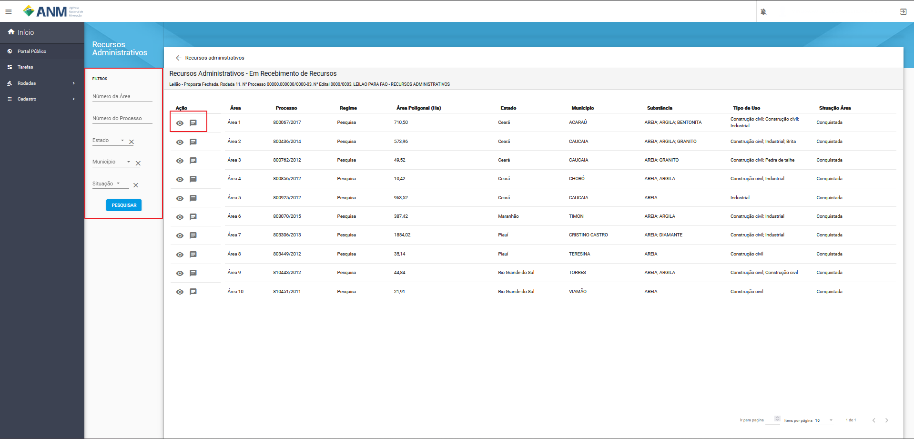
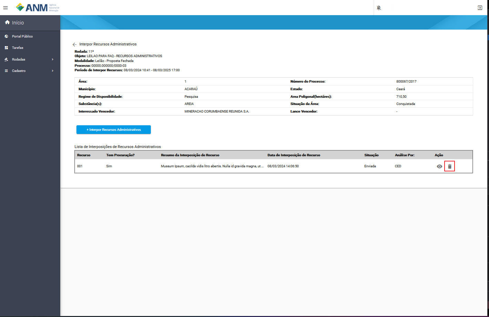

Recursos Administrativos
========================
Fase do procedimento de Disponibilidade de Áreas no qual usuários podem apresentar recursos instruídos com informações e documentos que comprovem as razões alegadas.

O recurso administrativo deverá ser apresentado, exclusivamente, por meio da Plataforma SOPLE e no período definido no Edital.

O recurso administrativo tramitará, no máximo, por três instâncias administrativas, sendo a Comissão de Edital de Disponibilidade (CED), a Superintendência de Ordenamento Mineral e Disponibilidade de Áreas (SOD) e a Diretoria Colegiada (DIRC).

Rotas de Acesso aos Recursos Administrativos
============================================

Portal Público
##############
A partir dos detalhes do edital, no card Recursos Administrativos, no link Interpor Recursos Administrativos.
Lembrando que somente é possível fazer este procedimento durante o período de Interpor Recursos.
Ressalta-se que as datas início e fim do card referem respectivamente ao período de interposição de recursos e a análise final pela Diretoria Colegiada.

Portal do Minerador
###################
Acessado através do menu Rodadas, Recursos Administrativos, no qual será possível o usuário selecionar o edital referente a(s) área(s) que deseja realizar o(s) recurso(s).

.. image:: ../imagens/11.AcessoPainelRecursoAdministrativo.png

Filtros e Ações para Interposição de Recurso
############################################

Para a identificação das áreas os sistema disponibiliza os seguintes campos de pesquisa:

    - **Número da Área:** campo que corresponde o número da área dentro do edital.
    - **Número do Processo:** campo utilizado para pesquisa de um Processo específico, no formato reduzido (formato XXX.XXX/AAAA) relacionado ao edital.
    - **Estado:** possibilita a busca de Processos a partir da Unidade da Federação nos quais estes foram gerados.
    - **Situação da Área:** permite a busca de Processos a partir de sua situação no edital.
    - **Município:** possibilita a busca de Processos a partir do município no qual a área está localizada.
    - **Ação:**

        1) Detalhes da área (:fa:`fa-solid fa-eye`): permite a expansão de card com maiores detalhes sobre um Processo específico. Ao acessar esta opção, é exibido um card específico sobre o Processo, que contempla, além das informações já detalhadas anteriormente, diversas informações extraídas do histórico do Processo no Sistema de Cadastro Mineiro (SCM) e algumas outras.
        2) Interpor Recursos Administrativos (:fa:`fa-solid fa-commenting-o`): inicia o processo de interposição de recurso administrativo da áreas.

Interpor Recursos Administrativos
=================================
Ao clicar no item (:fa:`fa-solid fa-commenting-o`), o usuário é redirecionado para tela Interpor Recursos Administrativo, onde são apresentados os dados:

    - **Rodada:** campo que corresponde ao número da rodada do edital em que está sendo feita a solicitação.
    - **Objeto:** campo que corresponde ao objetivo a ser atingido com o edital.
    - **Modalidade:** campo que corresponde a modalidade do edital.
    - **Nº do Processo:** campo que corresponde ao número do processo SEI correspondente a rodada.
    - **Nº da Área:** campo que corresponde a área do edital no qual pretende interpor recurso.
    - **Período de Interpor Recursos:** campo que corresponde ao período em que o usuário/participante pode criar um recurso para a área.

Na tabela seguinte é apresentado os campos:

    - **Área:** campo que corresponde o número da área dentro do edital.
    - **Número do Processo:** campo que corresponde ao número do processo minerário relacionado a área do edital.
    - **Regime de Disponibilidade:** campo referente ao tipo de regime de disponibilidade no qual a área foi disponibilizada no edital.
    - **Área Poligonal:** campo referente ao tamanho da poligonal da área em hectares.
    - **Estado:** campo referente ao Estado em que se encontra a área.
    - **Município:** campo referente município que se encontra a área.
    - **Substância(s):** campo referente a(s) substância(s) relacionada(s) a área no edital vinculada ao cadastro mineiro.
    - **Situação da Área:** campo referente a situação da área no edital.
    - **Interessado Vencedor:** campo referente ao nome do interessado vencedor na fase de Oferta Pública ou de Leilão.
    - **Lance Vencedor:** campo referente ao valor da proposta financeira vencedora na fase de leilão.

Botão + Interpor Recursos Administrativos
#########################################

O botão fica habilitado durante todo o período determinado no edital pra interposição de recursos. A clicar é apresentado ao usuário/participante todos os dados que podem ser enviados para o Recurso.

    - **Tem Procuração?:** campo com a opção sim ou não, que habilita caso sim, a possibilidade de enviar a(s) procuração(ões) no formato de arquivo .PDF
    - **Resumo da interposição de Recurso:** campo para resumo do recurso limitado ao 200 caracteres, o preenchimento opicional.
    - **Anexar Recursos:** corresponde ao envio de anexos do recurso, sendo anexados um de cada vez e não possuindo limitação de arquivos.

**Importante:** O tamanho máximo do PDF que pode ser enviado para plataforma é **25 MB**.

.. image:: ../imagens/11.PreenchendoRecursoAdministrativo.png

Excluir Recurso Administrativo
##############################
O recurso poderá ser objeto de desistência enquanto não for julgado pela Diretoria Colegiada.

Ao clicar em excluir o sistema solicita uma confirmação do usuário.

.. image:: ../imagens/11.MensagemExclusaoRecurso.png

O recurso excluído ficará com a devida situação na “Lista de Interposições de Recursos Administrativos” e não será analisado pela respectiva instância que estiver quando for excluído.

.. image:: ../imagens/11.PosExclusaoRecurso.png

Adicionar Documentos
####################

O usuário após a interposição do recurso e até o julgamento em última instância poderá adicionar novos documentos ao recurso interposto, a partir da Plataforma SOPLE, para o exercício do contraditório e da ampla defesa.
A tela tem os mesmos dados da tela de inclusão além de apresentar todos os dados do que já estão no recurso sendo análogo ao botão “Visualizar”.

Análise da CED (Comissão do Edital de Disponibilidade)
######################################################

Ao finalizar o período de Interpor Recurso, a CED realizará a análise de cada um dos Recursos interpostos, com as seguintes decisões:

 - **Acatado**
 - **Acatado Parcialmente**
 - **Não Acatado**

Não Acatado

Após o período de análise dos recursos administrativos pela CED, é divulgado, conforme determinado no edital, o documento contendo as decisões e apresentado em detalhes dos recursos as Notas Técnicas elaboradas pela CED.

**Recurso acatado pela CED:**

A CED reconsidera a decisão das fases anteriores com a realização de ajustes necessários antes da fase de homologação e adjudicação e o recurso não será submetido apreciação da Superintendência de Ordenamento Mineral e Disponibilidade de Áreas (SOD). Na ‘Lista de Interposições de Recursos Administrativos’ a situação modifica para Acatado.

.. image:: ../imagens/11.AceiteCED.png

Em detalhes do recurso é aprentado a Nota Técnica elaborada pela CED.

.. image:: ../imagens/11.JustuficativaAceiteCED.png

**Recurso parcialmente acatado pela CED e Recurso não acatado:**

A CED não reconsidera a decisão (ou parte dela) das fases anteriores e o recurso será submetido apreciação da Superintendência de Ordenamento Mineral e Disponibilidade de Áreas (SOD). Na ‘Lista de Interposições de Recursos Administrativos’ a situação modifica para Parcialmente Acatado ou Não Acatado.

.. image:: ../imagens/11.ParcialmenteAcatadoCED.png

Em detalhes do recurso é apresentado a Nota Técnica elaborada pela CED.

.. image:: ../imagens/11.DetalhesParcialmenteAcatadoCED.png
.. image:: ../imagens/11.DetalheNaoAcatadoCED.png

Análise da SOD (Superintendência de Ordenamento Mineral e Disponibilidade de Áreas)
###################################################################################

A SOD realizará a análise de cada um dos Recursos interpostos, com as seguintes decisões:

 - **Acatado**
 - **Acatado Parcialmente**
 - **Não Acatado**

Após o período de análise dos recursos administrativos pela SOD, é divulgado, conforme determinado no edital, o documento contendo as decisões e apresentado em detalhes dos recursos as Notas Técnicas elaboradas pela SOD.

**Recurso acatado pela SOD:**
A SOD reconsidera a decisão das fases anteriores com a realização de ajustes necessários antes da fase de homologação e adjudicação e o recurso não será submetido ao julgamento, em última instância, da Diretoria Colegiada da ANM. Na ‘Lista de Interposições de Recursos Administrativos’ a situação modifica para Acatado.

Em detalhes do recurso é apresentado a Nota Técnica elaborada pela SOD.

.. image:: ../imagens/11.AcatadoDetalheSOD.png

**Recurso parcialmente acatado pela SOD e Recurso não acatado:**

A SOD mantem a decisão da CED, no qual o recurso será submetido ao julgamento, em última instância, da Diretoria Colegiada da ANM (DIRC). Na ‘Lista de Interposições de Recursos Administrativos’ a situação modifica para Parcialmente Acatado ou Não Acatado.

.. image:: ../imagens/11.ParcialmenteAcatadoSOD.png

Em detalhes do recurso é apresentado a Nota Técnica elaborada pela SOD.

.. image:: ../imagens/11.NapAcatadoDetalheSOD.png

Análise da DIRC (Diretoria Colegiada da ANM)
############################################

A DIRC realizará a análise de cada um dos Recursos interpostos, com as seguintes decisões:

 - **Acatado**
 - **Acatado Parcialmente**
 - **Não Acatado**

Após o período de análise dos recursos administrativos pela DIRC é apresentado em detalhes dos recursos as decisões da DIRC.

**Recurso acatado pela DIRC:**
As decisões das fases anteriores são reconsideradas com a realização de ajustes necessários antes da fase de homologação e adjudicação. Na ‘Lista de Interposições de Recursos Administrativos’ a situação modifica para Acatado.

.. image:: ../imagens/11.AcatadoDirc.png

Em detalhes do recurso é apresentado o documento de decisão elaborado pela DIRC.

.. image:: ../imagens/11.DetalheAcatadoDirc.png

**Recurso parcialmente acatado pela DIRC e Recurso não acatado:**

A DIRC mantem a decisão da SOD, havendo possíveis ajustes, quando parcialmente acatado, antes da fase de homologação e adjudicação. Na ‘Lista de Interposições de Recursos Administrativos’ a situação modifica para Parcialmente Acatado ou Não Acatado.

.. image:: ../imagens/11.NaoAcatadoDirc.png

Em detalhes do recurso é apresentado a Nota Técnica elaborada pela DIRC.

