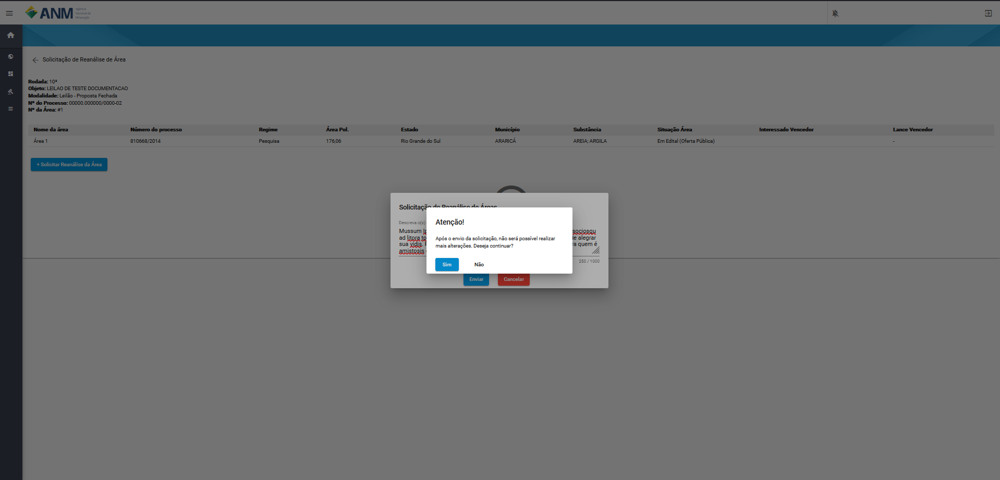

Reanálise de Áreas
==================
Os usuários podem solicitar reanálises de aptidão de áreas selecionadas para a rodada mediante uma justificativa técnica e até o prazo definido no Edital.

Importante
##########
 - O Interessado deve estar logado no SOPLE para ter acesso a realizar a solicitação de reanálise de áreas;
 - A Solicitação pode ser feita até o prazo definido em edital;
 - Todas as solcitações serão analisadas pela CED (Comissão do Edital de Disponibilidade);

Rotas de Acesso a Solicitação
=============================

Portal Público
##############
A partir dos detalhes do edital, nos quais foi adicionado o botão "Solicitar Reanálise de Áreas".

.. image:: ../imagens/12.PortalPublicoSolicitarRetiradaAreas.png

Portal do Minerador
###################
Acessado através do menu Rodadas, Solicitação de Reanálise de Áreas, no qual será possível o usuário selecionar o edital referente a(s) área(s) que deseja realizar a solicitação.

Filtros e Ações para Solicitar Reanálise de Áreas
#################################################

Para a identificação das áreas os sistema disponibiliza os seguintes campos de pesquisa:

    - **Número da Área:** campo que corresponde o número da área dentro do edital.
    - **Número do Processo:** campo utilizado para pesquisa de um Processo específico, no formato reduzido (formato XXX.XXX/AAAA) no Estoque de Áreas do SOPLE.
    - **Estado:** possibilita a busca de Processos a partir da Unidade da Federação nos quais estes foram gerados.
    - **Situação da Área:** permite a busca de Processos a partir de sua situação de aptidão do SOPLE (para maiores detalhes, ver seção “Informações gerais dos Processos”).
    - **Município:** possibilita a busca de Processos a partir do município no qual a área está localizada.
    - **Ação:**

        1) Detalhes da área (:fa:`fa-solid fa-eye`): permite a expansão de card com maiores detalhes sobre um Processo específico. Ao acessar esta opção, é exibido um card específico sobre o Processo, que contempla, além das informações já detalhadas anteriormente, diversas informações extraídas do histórico do Processo no Sistema de Cadastro Mineiro (SCM) e algumas outras.
        2) Solicitar Reanálise de Áreas (:fa:`fa-solid fa-commenting-o`): inicia o processo de solicitação de reanálise de aptidão de áreas.

Solicitar Reanálise de Áreas
============================

Ao clicar no item (:fa:`fa-solid fa-commenting-o`), o usuário é redirecionado para tela Solicitação de Reanalise de Área, onde são apresentados os dados:
    - **Rodada:** campo que corresponde ao número da rodada do edital em que está sendo feita a solicitação.
    - **Objeto:** campo que corresponde ao objetivo a ser atingido com o edital.
    - **Modalidade:** campo que corresponde a modalidade do edital.
    - **Nº do Processo:** campo que corresponde ao número do processo SEI correspondente a rodada.
    - **Nº da Área:** campo que corresponde a área do edital correspondente solicitação de reanálise de aptidão.

Na tabela seguinte é apresentado os campos:
    - **Número da área:** campo que corresponde o número da área dentro do edital.
    - **Número do Processo:** campo que corresponde ao número do processo minerário relacionado a área do edital.
    - **Regime:** campo referente ao tipo de regime de disponibilidade no qual a área foi disponibilizada no edital.
    - **Área Pol:** campo referente ao tamanho da poligonal da área em hectares.
    - **Estado:** campo referente ao Estado em que se encontra a área.
    - **Munícípio:** campo referente município que se encontra a área.
    - **Substância(s):** campo referente a(s) substância(s) relacionada(s) a área no edital vinculada ao cadastro mineiro.
    - **Situação da Área:** campo referente a situação da área no edital.
    - **Interessado Vencedor:** campo referente ao nome do interessado vencedor na fase de Oferta Pública ou de Leilão.
    - **Lance Vencedor:** campo referente ao valor da proposta financeira vencedora na fase de leilão.

Botão + Solicitar Reanálise de Áreas
************************************

Caso o botão esteja habilitado, ao clicar o sistema apresenta uma janela no qual o minerador pode informar em, no máximo, 1000 caracteres o motivo da reanálise de aptidão da área.

Ao terminar o preenchimento e clicar em Enviar, o sistema apresenta uma mensagem informando que não será possível realizar alterações na solicitação.

Excluir Solicitação de Reanálise de Áreas
*****************************************
Caso o usuário tenha identificado que exista a necessidade de excluir a solicitação realizada, é possível remover essa solicitação caso ainda não tenha resposta da CED.

.. image:: ../imagens/12.ExcluirRetirada.png

Resultado da Solicitação de Reanálise de Áreas
**********************************************

A situação da solicitação pode ser:

    - **Enviada:** indica o envio da solicitação, mas ainda sem a análise da CED.
    - **Excluída:** indica que foi removida pelo solicitante.
    - **Não Retirada:** indica que identifica que o motivo da solicitação de reanálise de aptidão da área foi analisado pela CED e não foi acatado.
    - **Retirada:** indica que o motivo da solicitação de reanálise de aptidão da área foi analisado pela CED e foi acatado. Neste caso, resultará na ação de retirada da área do edital acompanhada da respectiva Nota Técnica.

