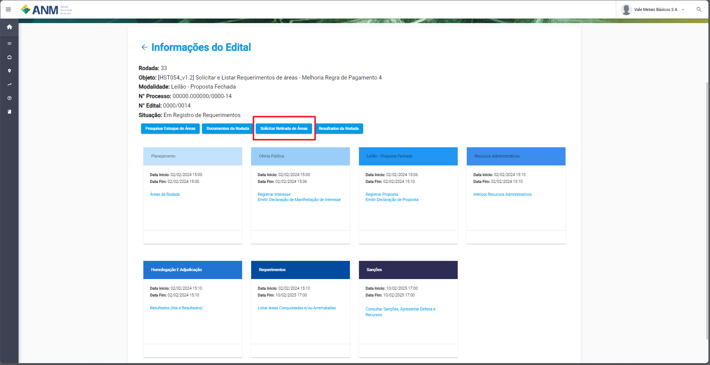
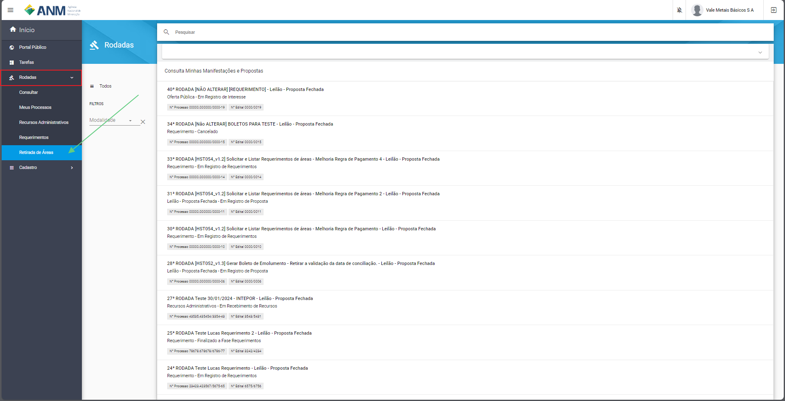
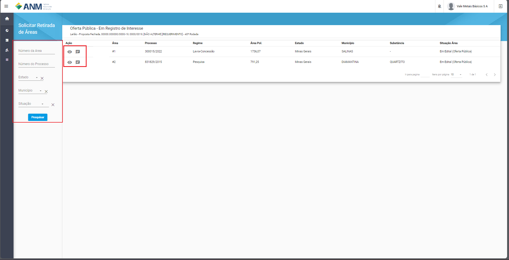
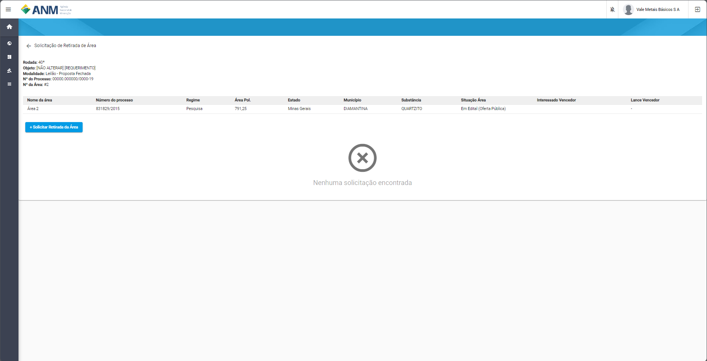
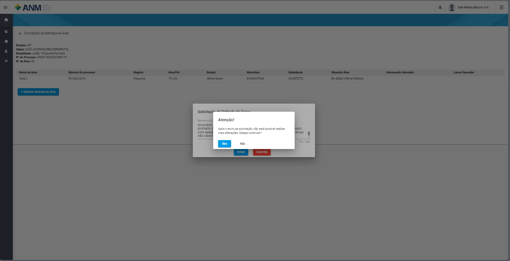
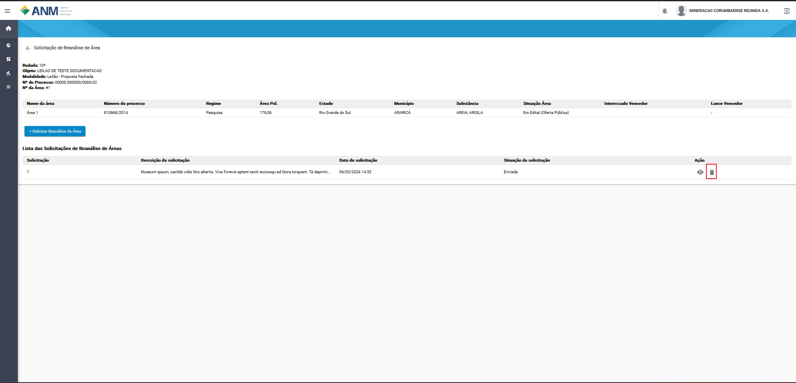

Solicitar Retirada de Áreas
===========================
Recurso criado para que os interessados em áreas que estão incluidas em uma rodada, possam fazer a solicitação da retirada de uma ou mais áreas, passando o motivo para o mesmo.

Datalhes do procecsso
#####################
 - O Interessado deve estar logado no SOPLE para ter acesso a realizar a solicitação de retirada;
 - A Solicitação pode ser feita em qualquer fase do edital;
 - Todas as solcitações são avalidas pela CED (Comissão do Edital de Disponibilidade);

Rotas de Acesso a Solcitação
**********************

Portal Público
##############
Através do detalhes do edital, onde foi adicionado o botão "Solicitar Retirada de Áreas".

Portal do Minerador
###################
Acessado através do menu Rodadas, Retirada de Áreas, onde será póssivel selecionar o edital a qual deseja pedir a retirada da área.

Filtros e Ações para Solicitar Retirada de Áreas
************************************************

Para a identificação das áreas os sistema disponibiliza os campos de pesquisa:

    - **Número da Área:** campo que corresponde o número da área dentro do edital.
    - **Número do Processo:** campo utilizado para pesquisa de um Processo específico, no formato reduzido (formato XXX.XXX/AAAA) no Estoque de Áreas do SOPLE.
    - **Estado:** possibilita a busca de Processos a partir da Unidade da Federação nos quais estes foram gerados.
    - **Situação da Área:** permite a busca de Processos a partir de sua situação de aptidão do SOPLE (para maiores detalhes, ver seção “Informações gerais dos Processos”).
    - **Ação:**
        1) Detalhes: contém ícone que permite a expansão de card com maiores detalhes sobre um Processo específico. Ao acessar esta opção, é exibido um card (ver exemplo abaixo) específico sobre o Processo, que contempla, além das informações já detalhadas anteriormente, diversas informações extraídas do histórico do Processo no Sistema de Cadastro Mineiro (SCM) e algumas outras. Ressaltamos as seguintes:
        2) Solicitar Retirada: que inicia o processo de retirada da área em questão.

Solicitar Retirada de Área
**************************

Ao clicar em Solicitar Retirada de Área, o usuário é redirecionado para tela Solicitação de Retirada de Área, onde são apresentados os dados:
    - **Rodada:** campo que corresponde ao número da rodada do edital em que está sendo feita a solicitação.
    - **Objeto:** campo que corresponde ao objetivo a ser atingido com o edital.
    - **Moldalidade:** campo que corresponde a modalidade do edital, onde se identificar se é um edital de Leilão Proposta Fechada ou Avaliação Social.
    - **Nº do Processo:** campo que corresponde ao número que foi definido par aidentificação do edital.
    - **Nº da Área:** campo que corresponde a área do edital correspondente a solcitação de retirada.

Na tabela seguinde é apresentado os campos:
    - **Número da área:** campo que corresponde o número da área dentro do edital.
    - **Número do Processo:** campo que corresponde ao número que foi definido par aidentificação do edital.
    - **Regime:** campo referente ao tipo de regime podem ser Pesquisa, Lavra-PLG e Lavra-Concessão.
    - **Área Pol:** campo referente ao tamanho da poligonal da área.
    - **Estado:** campo referente ao Estado em que se encontra a área.
    - **Munícípio:** campo referente município que se encontra a área.
    - **Substâcia(s):** campo referente as substâncias que podem já estar cotidas na área.
    - **Substâcia(s):** campo referente a situação da área no edital.
    - **Interessado:** campo referente ao nome do interessado vencedor na fase de Leilão.
    - **Lance Vencedor:** campo referente ao valor em reais oferecidos pela área.

Botão + Solicitar Retirada da Área
##################################
Caso o botão esteja habiltiado, ao clicar o sistema apresetna uma janela onde o minerador pode informar em 1000 caracteres o seu motivo pela retirada da Área.

.. image:: ../imagens/12.SolicitaRetirada.png

Ao terminar o preenchimento e clicar em Enviar, o sistema apresenta uma mensagem informando que não será possível realizar alterações na solicitação.

Excluir Solcitação de Retirada de Área
######################################
Caso o usuário tenha identificado que existe a necessidade de excluir o requerimento que fez, é possivel remover essa solicitação caso ainda não tenha transitado 

Resultado da Solcitação de Retirada
###################################

As situações da solcitação podem ser:

    - **Enviada:** que representa que a solicitação foi enviada, mas ainda não foi analizada.
    - **Excluida:** que foi removida pelo solicitante.
    - **Não Retirada:** que identifica que a solicitação não foi acatada.
    - **Retirada:** que identifica que a área foi removida do edita, nesse caso é garado um documento que fique anexado ao edital.
