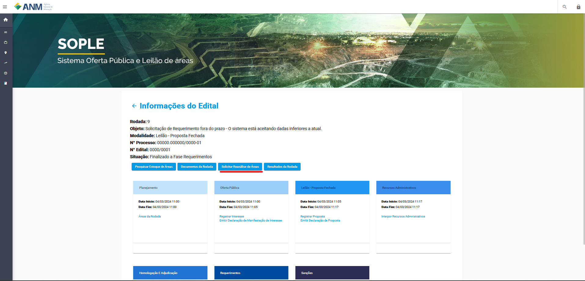
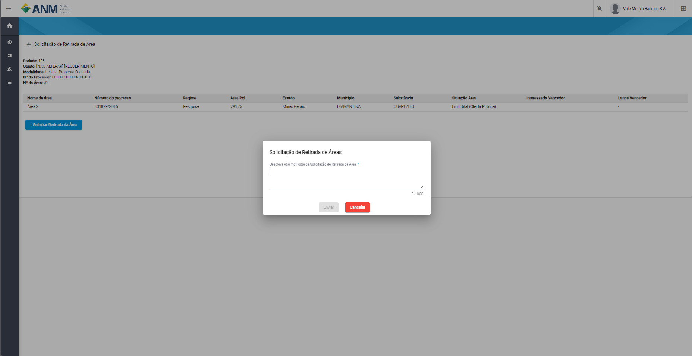

Solicitar Retirada de Áreas
===========================
Recurso criado para que os interessados em áreas que estão incluidas em uma rodada, possam fazer a solicitação da retirada de uma ou mais áreas, passando o motivo para o mesmo.

Datalhes do procecsso
**********************
 - O Interessado deve estar logado no SOPLE para ter acesso a realizar a solicitação de retirada;
 - A Solicitação pode ser feita em qualquer fase do edital;
 - Totas as solcitações são avalidas pela Comissão do Edital de Disponibilidade;

Rotas de Acesso a Solcitação
############################

Portal Público
***************
Através do detalhes do edital, onde foi adicionado o botão "Solicitar Retirada de Áreas".

Portal do Minerador
*******************
Acessado através do menu Rodadas, Retirada de Áreas, onde será póssivel selecionar o edital a qual deseja pedir a retirada da área.

.. image:: ../imagens/12.PortalRetiradaAreas.png

Filtros e Ações para Solicitar Retirada de Áreas
################################################

Para a identificação das áreas os sitema disponibiliza os campos de pesquisa: Número da Área, Número do Processo, Estado, Município e Situação;
Em cada área é possível acessar a tela de talahes, que é padrão em todo o sistema e Solcitar a Retirada da Área.

.. image:: ../imagens/12.SolicitarRetiradaArea.png

Clicando em Solicitar Retirada de Área, o usuário é redirecionado para tela Solicitação de Retirada de Área, onde são apresentados os dados:
Rodada, Objeto, Moldalidade, Nº do Processo, Nº da Área e uma tabela com os detalhes da área, além do botão + Solcitar Retirada da Área.

Botão + Solicitar Retirada da Área
**********************************
Caso o botão esteja habiltiado, ao clicar o sistema apresetna uma janela onde o minerador pode informar em 1000 caracteres o seu motivo pela retirada da Área.

Ao terminar o preenchimento e clicar em Enviar, o sistema apresenta uma mensagem informando que não será possível realizar alterações na solicitação.

.. image:: ../imagens/12.MensagemAtencao.png

Excluir Solcitação de Retirada de Área
**************************************
Caso o usuário tenha identificado que existe a necessidade de excluir o requerimento que fez, é possivel remover essa solicitação caso ainda não tenha transitado 

.. image:: ../imagens/12.ExcluirRetirada.png
