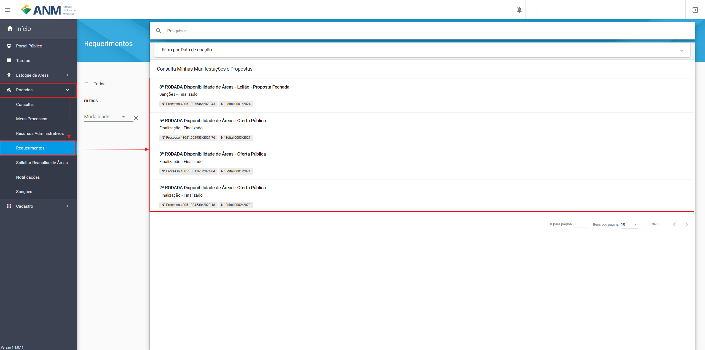
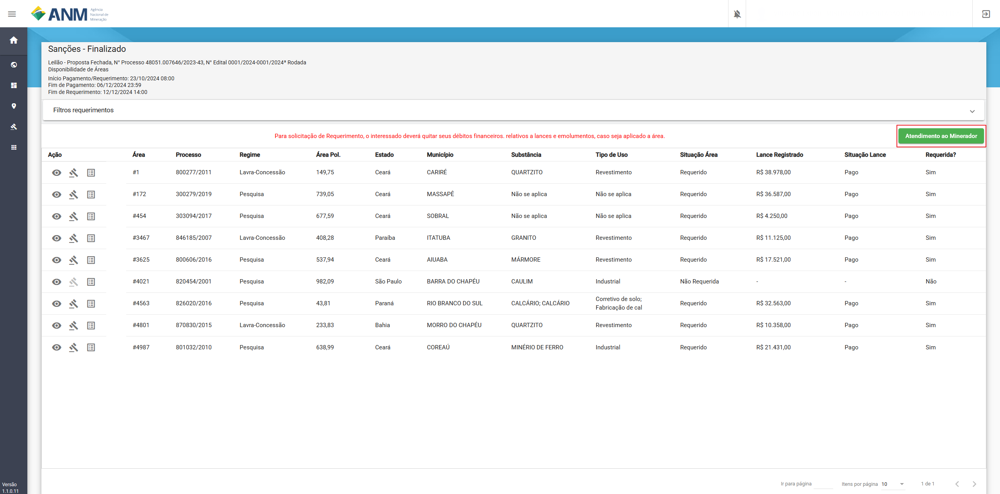
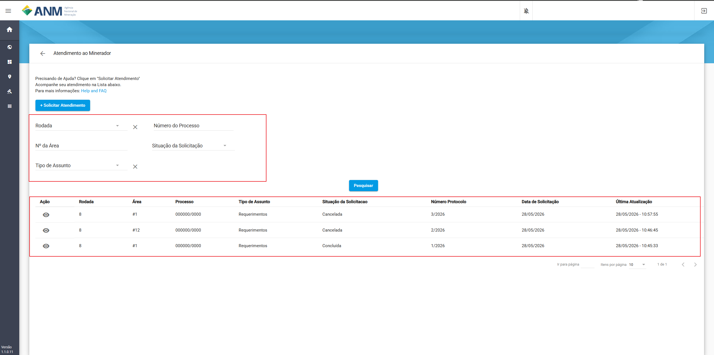
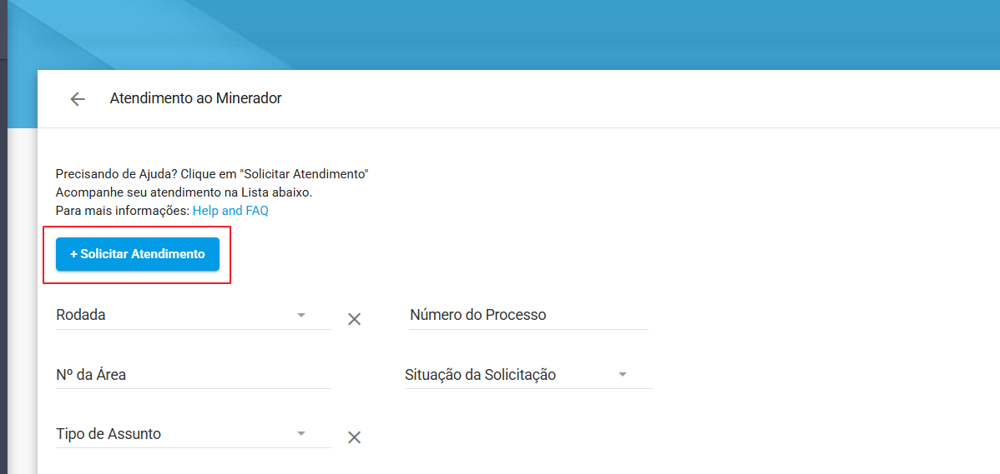
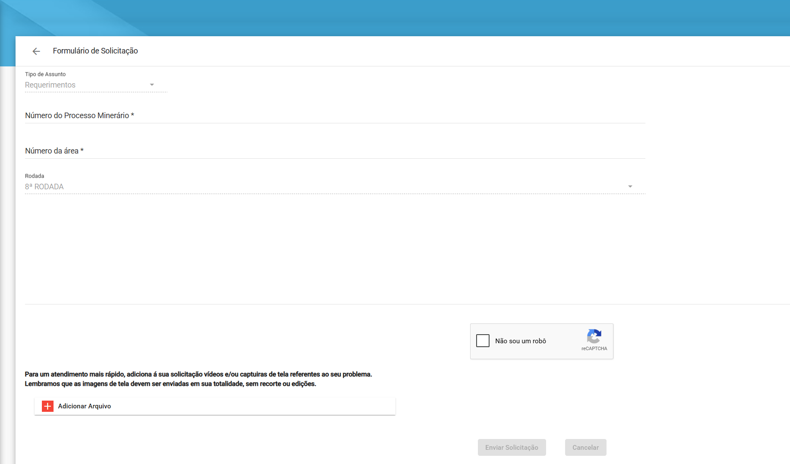

========================
Atendimento ao Minerador
========================

Com o objetivo de agilizar a comunicação entre a equipe técnica da Agência Nacional de Mineração (ANM) e os usuários do sistema SOPLE, disponibilizamos o módulo de Atendimento ao Minerador.

-------------
Como Acessar
-------------

Para acessar o canal de atendimento, siga os passos abaixo:

1. Faça login no sistema SOPLE.
2. Navegue até o **Painel do Minerador**.
3. Acesse o menu **Rodadas** e, em seguida, **Requerimentos**.
4. Selecione a rodada que deseja atendimento.
5. No canto superior direito da tela, clique no botão azul com o texto **"Atendimento ao minerador"**.

Você será redirecionado para a tela principal de Atendimentos ao Minerador.

-------------------------------------------------------

    
-------------------------------------------------------

---------------------
Painel de Atendimento
---------------------

O painel de Atendimento ao Minerador é a sua central de controle. Nesta tela, você pode visualizar o histórico de seus chamados, acompanhar o status de cada um ou abrir novas solicitações.

Filtros de Pesquisa
~~~~~~~~~~~~~~~~~~~

Para facilitar a localização de um chamado específico, você pode utilizar os seguintes filtros disponíveis na parte superior da tela:

* **Rodada**
* **Nº da Área**
* **Tipo de Assunto**
* **Número do Processo**
* **Situação da Solicitação**

Após preencher os parâmetros desejados, clique no botão azul **"Pesquisar"**.

Acompanhamento de Solicitações
~~~~~~~~~~~~~~~~~~~~~~~~~~~~~~

Os resultados da sua pesquisa (ou o seu histórico padrão) serão exibidos em uma tabela detalhada contendo as seguintes informações:

* **Ação:** Ícone de visualização (olho) para abrir os detalhes do chamado.
* **Rodada:** Número da rodada correspondente.
* **Área:** Identificação da área em questão (ex: #1, #12).
* **Processo:** Número do processo minerário.
* **Tipo de Assunto:** Categoria do atendimento (ex: Requerimentos).
* **Situação da Solicitação:** Status atual do seu atendimento (veja o glossário de status abaixo).
* **Número do Protocolo:** Identificador único do seu chamado.
* **Data de Solicitação:** Data em que o chamado foi aberto.
* **Última Atualização:** Data e hora da última modificação no chamado.

    
-------------------------------------------------------

----------------------------------
Como Solicitar um Novo Atendimento
----------------------------------

Para abrir um novo chamado com a equipe do SOPLE, siga o procedimento abaixo:

1. Na tela principal de Atendimento ao Minerador, clique no botão azul **"+ Solicitar Atendimento"**.

    
-------------------------------------------------------

2. O **Formulário de Solicitação** será aberto.
3. Preencha os campos obrigatórios (sinalizados com asterisco ``*``):
   
   * **Tipo de Assunto** (pré-selecionado)
   * **Número do Processo Minerário \***
   * **Número da área \***
   * **Texto do atendimento (Resposta) \***: Descreva detalhadamente a sua dúvida ou problema.

4. **Anexos (Opcional):**
   Clique em **"+ Adicionar Arquivo"** para enviar documentos que ajudem os analistas a entenderem o seu caso.
   
   .. note::
      O tamanho é limitado ao máximo de **25 MB por arquivo**.

   .. tip::
      **Para um atendimento mais rápido:** Adicione vídeos e/ou capturas de tela referentes ao seu problema. Lembramos que as imagens de tela devem ser enviadas em sua **totalidade, sem recortes ou edições**.

5. Marque a caixa de verificação de segurança (reCAPTCHA) **"Não sou um robô"**.
6. Clique no botão **"Enviar Solicitação"**.

    
-------------------------------------------------------

------------------------------------------
Glossário de Status (Fases do Atendimento)
------------------------------------------

Após a abertura da solicitação, ela passará por diferentes fases. Você pode acompanhar a situação na coluna "Situação da Solicitação" no painel principal. Entenda o que significa cada status:

**Aberto**
  Neste momento o atendimento ficará no status de Aberto, onde fica aguardando a fila e a interação de um membro da equipe técnica do SOPLE para resposta.

**Em andamento**
  Quando é atribuído um analista específico da ANM para verificar e tratar o seu atendimento.

**Aguardando Resposta do Solicitante**
  Neste momento o sistema está aguardando uma interação ou correção por parte do minerador. *Fique atento, pois o processo precisa da sua ação para continuar.*

**Aguardando Resposta da Comissão**
  Neste status o sistema indica que você já interagiu e agora está aguardando o retorno da equipe técnica do SOPLE.

**Concluída**
  Finalizado o atendimento e respondido conclusivamente pela equipe da ANM.

**Cancelada**
  Esse status **somente o Minerador poderá colocar**, indicando o encerramento do atendimento por sua própria decisão.
