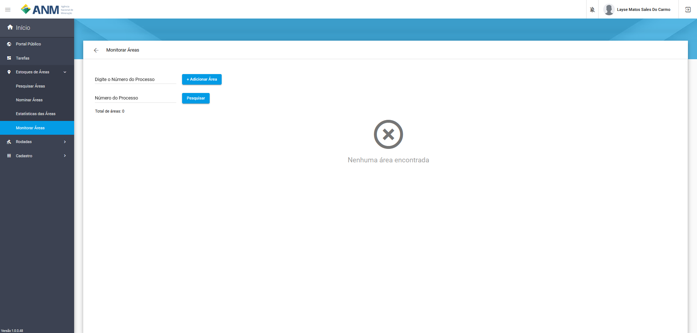
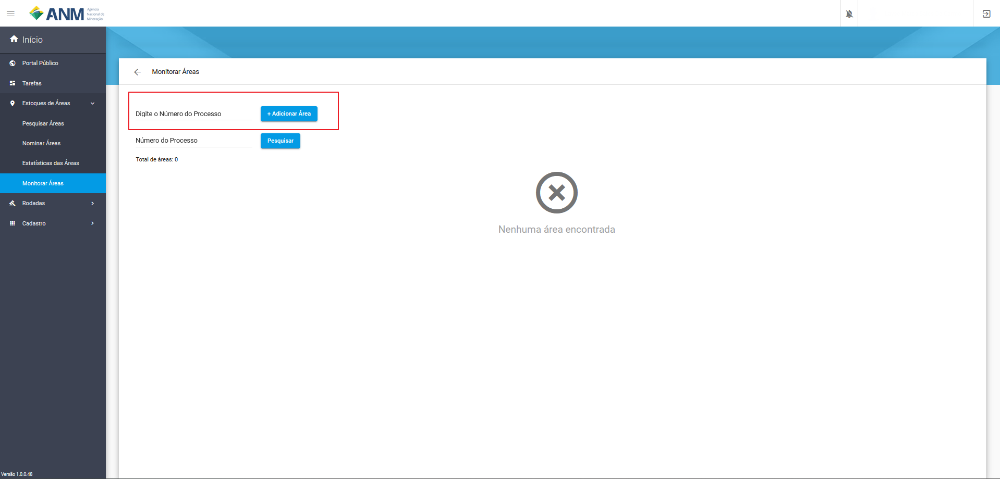
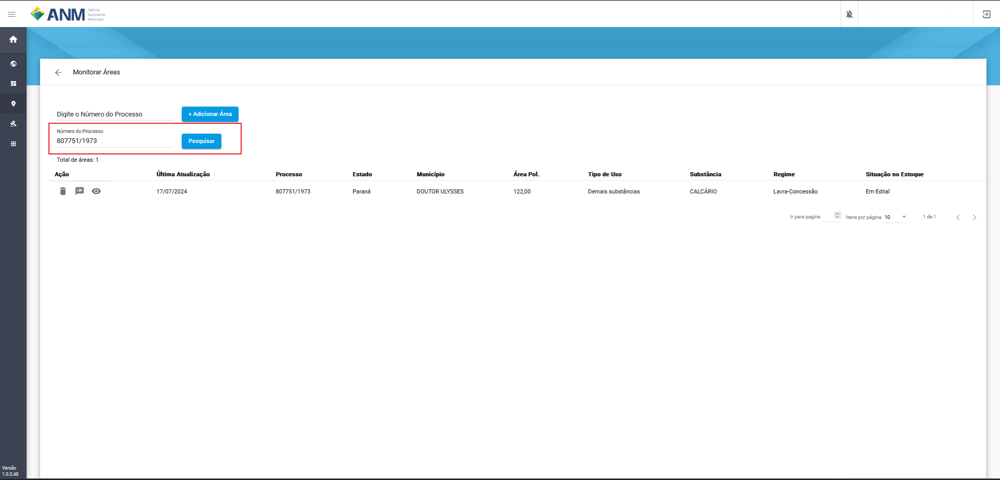
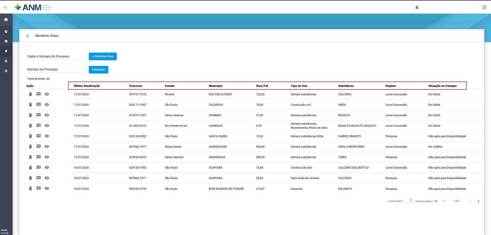
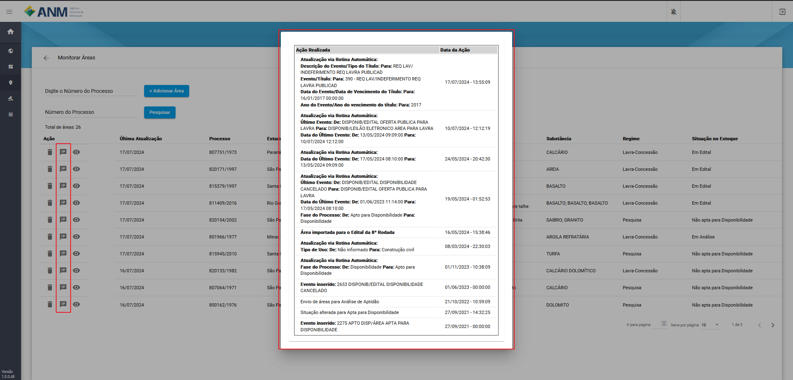
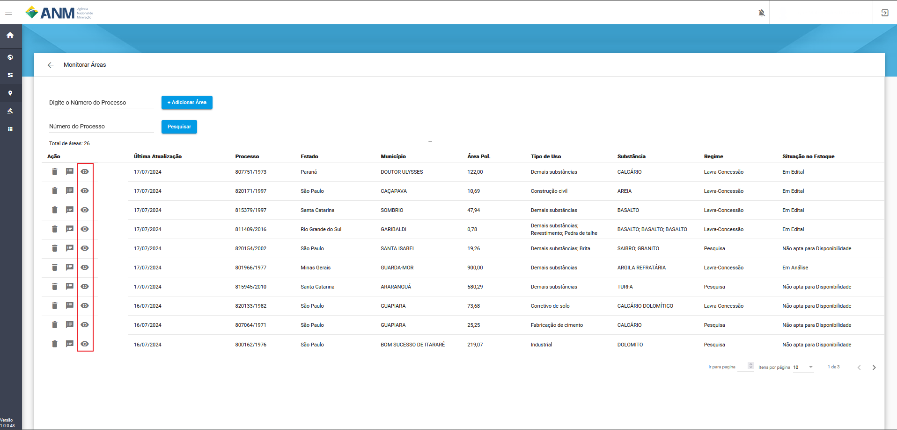
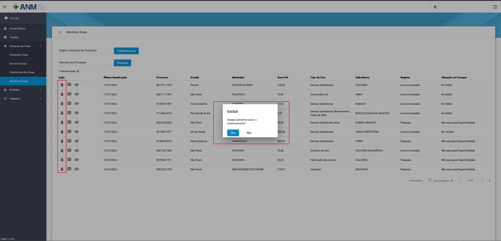

Monitoramento de Áreas
======================

A solução da ANM para o acompanhamento de áreas de forma específica de áreas de interesse para cada minerador, onde são facilitados o uso dos recursos de histórico, detalhes da área e principais dados do estoque do SOPLE.

.. image:: ../imagens/2.0TelaPrincipal.png

Dados e Ações da Interface
##########################

Na tabela seguinte é apresentado os campos:
    - **Última Atualização:** campo referente a última vez que houve atualização do processo.
    - **Processo:** campo que corresponde ao número do processo minerário relacionado a área do edital.
    - **Estado:** campo referente ao Estado em que se encontra a área.
    - **Município:** campo referente município que se encontra a área.
    - **Área Pol:** campo referente ao tamanho da poligonal da área em hectares.
    - **Tipo de Uso:** campo referente aos tipos de uso atribuídos a área.
    - **Substância(s):** campo referente a(s) substância(s) relacionada(s) a área no edital vinculada ao cadastro mineiro.
    - **Regime:** campo referente ao tipo de regime de disponibilidade no qual a área foi disponibilizada no edital.
    - **Situação no Estoque:** campo referente a situação da área no Estoque do SOPLE.

Ações:
    - **Excluir Monitoramento:** remove o monitoramento da área especifica.
    - **Visualizar Histórico:** abre uma modal contendo o histórico de ações da área.
    - **Detalhes da Área:** abre uma nova página contendo todos os detalhes da áreas encontrados na base de SOPLE.

Como encontrar o recurso
########################

Ao logar no sistema, e ser redirecionando para o Painel do minerador, em Estoque de Áreas, foi criada uma nova opção **Monitorar Áreas**.

.. image:: ../imagens/2.0LinkMonitorarAreas.png

Acessando o recurso  é apresentada a tela com dois campos um para inclusão, pesquisa das áreas incluídas e uma mensagem de que não foi encontrada nenhuma área. 

**OBS.:** Cada monitoramento é individual, sendo assim, não é divulgado ou mesmo apresentando a outros usuários quem está monitorando qual área.

Adicionar Áreas para monitoramento
##################################

No campo **Digite o Nùmero do Processo** o minerador informa um número válido de processe minerário e clica em **+ Adicionar Área** que faz com que essa área passe a ser acompanhada.

Pesquisa de áreas monitoradas
#############################

No campo **Número do Processo** digite o número da área que está sendo monitorada e que deseja filtrar e clique em **Pesquisar**.

Ordenação dos resultados por coluna
###################################

Cada um dos campos apresentados como resultado tem a função de ordenação, sendo do **Menor para o Maior** e do **Maior para o Menor** seguindo as setas apresentadas ao lado do nome da coluna, essas ordenações não são cumulativas, 
ou seja, não é possível ordenar mais de uma coluna.

Visualizar Histórico
####################

Para facilitar a leitura das mudanças que estão acontendo na área monitorada, foi criado uma opção direta ao **Histórico de Ações** para facilitar monitoramento das ações realizadas pela equipe da ANM.

Detalhes das Áreas
##################

Ao acessar esta opção, é exibida uma página específica sobre o Processo, que contempla, além das informações já detalhadas anteriormente, diversas informações extraídas do histórico do Processo no Sistema de Cadastro Mineiro (SCM) e algumas outras.

.. image:: ../imagens/2.0DetalheDaArea.png

Excluir Monitoramento da Área
#############################

Está opção permite ao minerador remover o monitoramento da área, retirando o da lista. Ao clicar no botão é necessário confirmar a mensagem de exclusão, lembrando que ao retirar uma área do monitoramento ela poderá ser inserida novamente.

