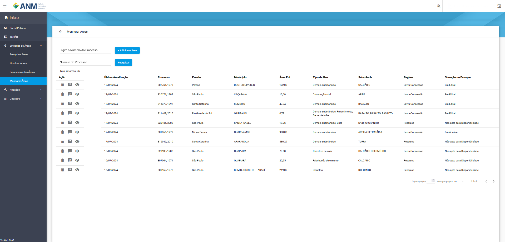
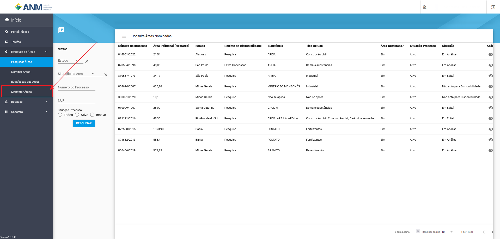
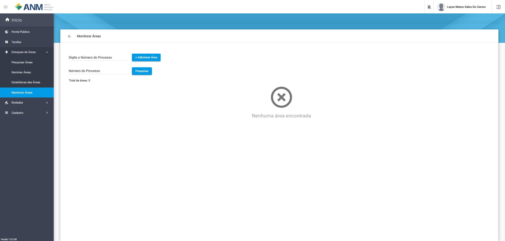
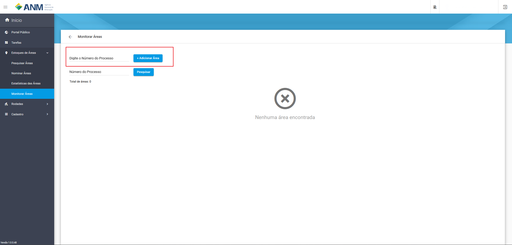
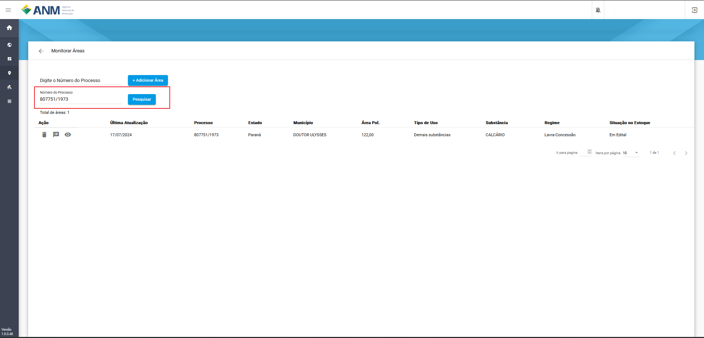
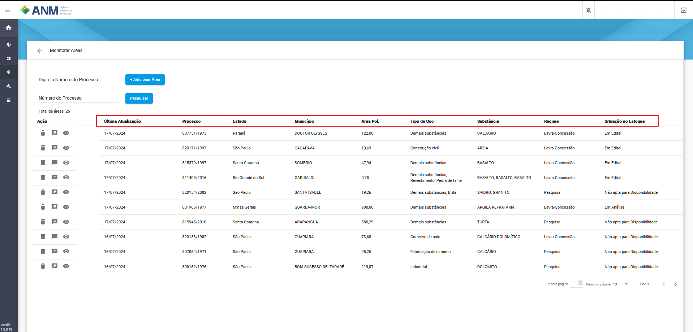
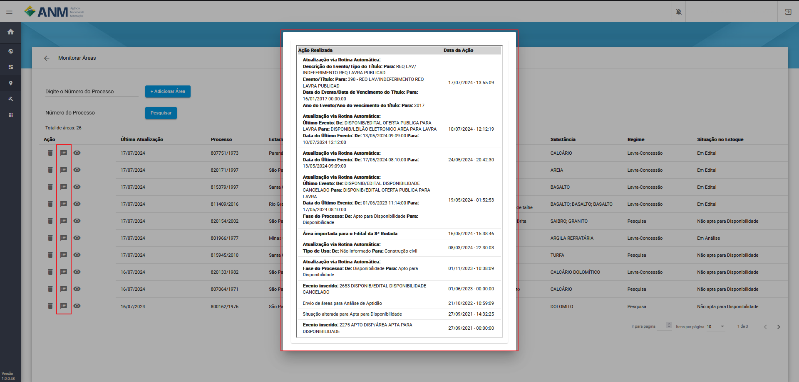
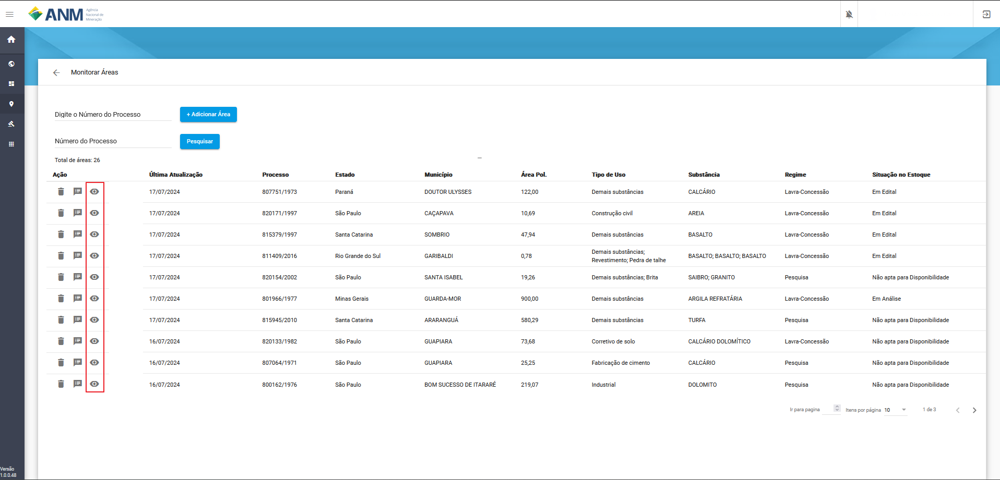
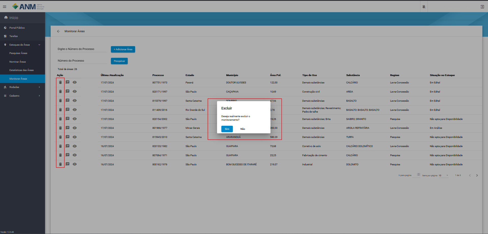

Monitoramento de Áreas
======================

A Solução da ANM para o acompanhamento de áreas do Estoque de Disponibilidade, de forma específica para cada minerador, facilitando o uso dos recursos de histórico, detalhes da área e demais dados do SOPLE. 

Dados e Ações da Interface
##########################

Na tabela seguinte é apresentado os campos:
    - **Última Atualização:** campo referente à data que ocorreu a última atualização de um ou mais dados da área monitorada.
    - **Processo:** campo que corresponde ao número do processo minerário relacionado à área monitorada.
    - **Estado:** campo referente ao Estado em que se encontra a área monitorada.
    - **Município:** campo referente ao município que se encontra a área monitorada.
    - **Área Pol:** campo referente ao tamanho da poligonal da área monitorada em hectares.
    - **Tipo de Uso:** campo referente à aplicação da(s) substância(s) relacionada(s) à área monitorada, conforme Cadastro Mineiro.
    - **Substância(s):** campo referente  à(s) substância(s) vinculada(s) à área monitorada, conforme Cadastro Mineiro.
    - **Regime:** campo referente ao tipo de regime de disponibilidade vinculado à área monitorada.
    - **Situação no Estoque:** campo referente à situação da área monitorada, conforme Estoque de Áreas do SOPLE.

Ações:
    - **Excluir Monitoramento:** remove o monitoramento da área especifica.
    - **Visualizar Histórico:** abre uma modal contendo o histórico de ações da área.
    - **Detalhes da Área:** abre uma nova página contendo todos os detalhes da área na base do SOPLE.

Como encontrar o recurso
########################

Ao logar no sistema, e ser redirecionando para o Painel do minerador, em Estoque de Áreas, foi criada uma nova opção **Monitorar Áreas**.

Acessando o recurso, é apresentada a tela com dois campos: um para inclusão de novas áreas e outro para pesquisa das áreas incluídas.

**OBS.:** A ferramenta de Monitorar Áreas é individual e de uso privado, ou seja, a ANM não divulgará a outros usuários, ou ao público, dados e/ou informações sobre as áreas monitoradas, como número de usuários monitorando uma área determinada e/ou suas identidades.

Adicionar Áreas para monitoramento
##################################

No campo **Digite o Número do Processo** o minerador informa um número válido de processe minerário e clica em **+ Adicionar Área** que faz com que a área do processo passe a ser monitorada.

Pesquisa de áreas monitoradas
#############################

No campo **Número do Processo** digite o número da área que está sendo monitorada e que deseja filtrar e clique em **Pesquisar**.

Ordenação dos resultados por coluna
###################################

Cada um dos campos apresentados como resultado tem a função de ordenação, sendo do **Menor para o Maior** e do **Maior para o Menor** seguindo as setas apresentadas ao lado do nome da coluna, essas ordenações não são cumulativas, 
ou seja, não é possível ordenar mais de uma coluna.

Visualizar Histórico
####################

Para facilitar o acompanhamento da área monitorada, foi criado um acesso direto ao **Histórico de Ações**, com a lista de todas as ações relativas à Disponibilidade de Áreas.

Detalhes das Áreas
##################

Ao acessar esta opção, é exibida uma página específica sobre o Processo, que contempla, além das informações já detalhadas anteriormente, diversas informações extraídas do histórico do Processo no Sistema de Cadastro Mineiro (SCM) e algumas outras.

.. image:: ../imagens/2.0DetalheDaArea.png

Excluir Monitoramento da Área
#############################

Está opção permite ao minerador remover o monitoramento da área, retirando o da lista. Ao clicar no botão é necessário confirmar a mensagem de exclusão, lembrando que ao retirar uma área do monitoramento ela poderá ser inserida novamente.

