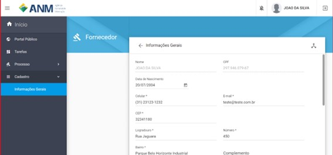
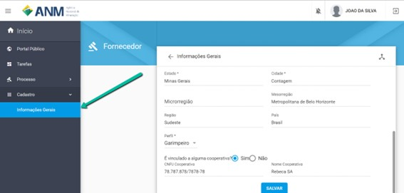
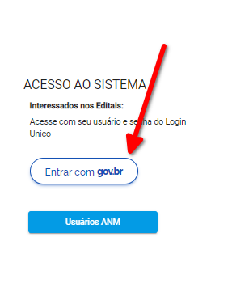

Perguntas frequentes sobre a Autenticação no SOPLE e Cadastro necessário
=========================================================================

Nesse tópico serão abordados os requisitos minímos para acesso e utilização do SOPLE além de pontos importantes do Login Único do Governo Federal que é necessário para a utilização dos recursos.

Quais são os Requisitos Mínimos para acessar o SOPLE? 
#####################################################

Os navegadores Chrome, Firefox ou Edge em versões atualizadas, uma conta gov.br (não tem aquilo de ser mínimo conta ouro ou prata no gov.br? Porque se tiver é preciso adicionar aqui) e ter o cadastrado validado com certificado digital, seja e-CPF ou e-CNPJ.

Para saber mais sobre  os níveis de acesso do login único consulte: https://www.gov.br/governodigital/pt-br/conta-gov-br/niveis-da-conta-govbr/saiba-mais-sobre-os-niveis-da-conta-govbr

O Acesso através do Login Único (acesso.GOV.BR) do Governo Federal será obrigatório para uso do SOPLE?
######################################################################################################

Sim! O acesso inicial sempre será por meio do Login Único do governo federal, tanto para pessoas jurídicas como pessoas físicas. 

O cadastro do Login Único está disponível a todos os cidadãos brasileiros pelo site https://acesso.gov.br/.

Preciso de um certificado digital para usar o SOPLE da ANM?
###########################################################

Sim. O usuário precisa ter uma conta no Login único do governo federal (acesso.gov.br), seja pessoa física ou jurídica, e ter o cadastrado validado 
com certificado digital, seja e-CPF ou e-CNPJ. Com esta conta poderá acessar o SOPLE e participar tanto da oferta pública quanto 
do Leilão de áreas. 

Não tenho cadastro no Login Único (aceso.gov.br). Como devo fazer?
##################################################################

Passo 1 

Acesse https://acesso.gov.br/ e crie sua conta no Login Único

Passo 2

Obtenha os selos e-CPF ou e-CNPJ, conforme o caso, a partir do respectivo certificado digital.

Mais informações sobre o Login Único podem ser obtidas no respectivo FAQ: https://faq-login-unico.servicos.gov.br/en/latest/

Como realizar meu cadastro para participar do Edital de PLG?
############################################################

Passo 1 

Acesse https://acesso.gov.br/ e crie sua conta no Login Único

Passo 2

No primeiro acesso ao sistema o interessado será direcionado para a página de cadastro, onde deverá preencher os dados solicitados. Ao preencher o item “CEP”, o sistema completará as informações de endereço e região. O usuário ainda precisa informar se tem perfil de garimpeiro, cooperativa de garimpeiros ou se é apenas minerador. 

Obs.: No edital de Avaliação Social de PLG é permitida a participação apenas de Garimpeiros e Cooperativa de Garimpeiros. 

A qualquer tempo o interessado poderá atualizar seus dados após autenticar no sistema, acessando o menu lateral esquerdo "Cadastro", selecionando "Informações Gerais", conforme imagem abaixo. 

Como acessar o SOPLE?
#####################

Acesse o endereço eletrônico:  https://sople.anm.gov.br

Navegue no Portal Público de Oportunidades para encontrar os editais e as áreas de seu interesse. 
        
Autenticação no SOPLE pode ser feita clicando no "Cadeado", no canto superior direito,
e selecionando a opção "Entrar com GOV.BR", conforme imagens a seguir. 
    
.. image:: ../imagens/3.0AcessoAoSOPLECadeado.png

Clique no cadeado no canto superior direito. 

Clique no botão "Entrar com GOV.BR".