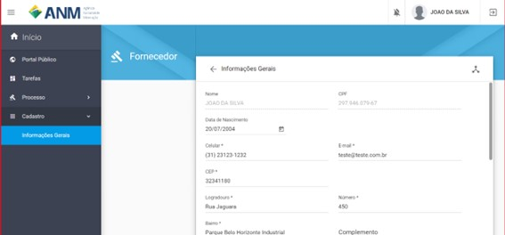

Como realizar meu cadastro para participar do Edital de PLG?
============================================================

Passo 1 

Acesse https://acesso.gov.br/ e crie sua conta no Login Único

Passo 2

No primeiro acesso ao sistema o interessado será direcionado para a página de cadastro, onde deverá preencher os dados solicitados. Ao preencher o item “CEP”, o sistema completará as informações de endereço e região. O usuário ainda precisa informar se tem perfil de garimpeiro, cooperativa de garimpeiros ou se é apenas minerador. 

Obs.: No edital de Avaliação Social de PLG é permitida a participação apenas de Garimpeiros e Cooperativa de Garimpeiros. 

A qualquer tempo o interessado poderá atualizar seus dados após autenticar no sistema, acessando o menu lateral esquerdo "Cadastro", selecionando "Informações Gerais", conforme imagem abaixo. 

.. image:: ../imagens/3.7CadastroAvalialcaoSocial2.jpg
