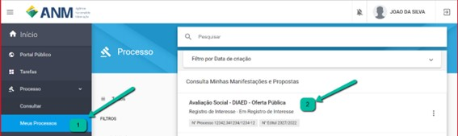
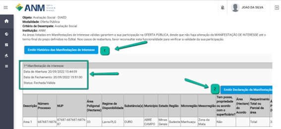
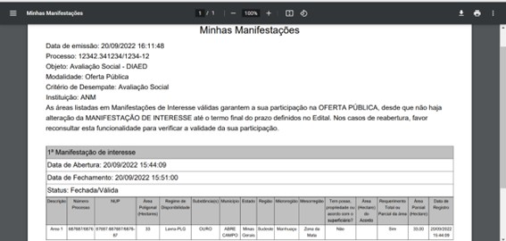

Minha manifestação de interesse está válida?
=============================================
  
Confira na funcionalidade de Histórico de Manifestação de Interesse se a sua Manifestação de interesse está válida.

Passo 1

Após autenticado no SOPLE, acesse o Menu lateral esquerdo e selecione "Processos", "Meus Processos" e depois selecione o Edital que deseja exibir o Histórico de Manifestação de Interesse. Conforme imagem a seguir. 

Passo 2 

Verifique no topo da Manifestação de Interesse a informação de que a Manifestação de Interesse está com a situação "Finalizada" e "Válida", caso esteja "Aberta" e "Inválida", utilize a funcionalidade de Finalizar para validar sua Manifestação de Interesse. 

No Minhas Manifestações você poderá emitir o "Histórico de Manifestações de interesse" do seu usuário no edital selecionado ou emitir a "Declaração de Manifestação de Interesse", neste caso disponível apenas para Manifestações de interesse válidas e finalizadas. 

