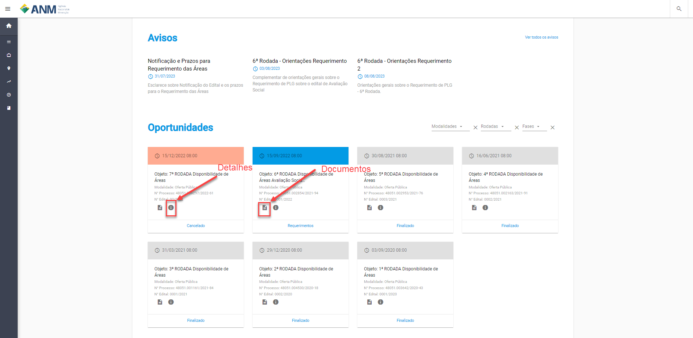
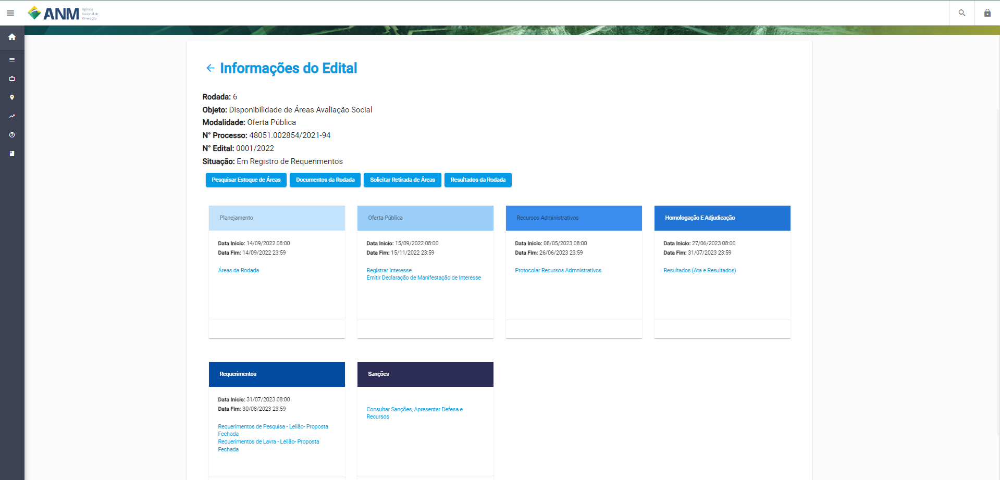
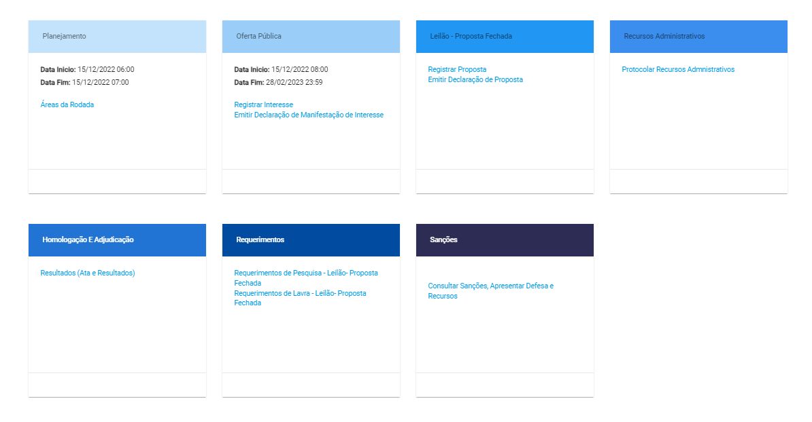

Painel Público de Oportunidades
===============================

Acesse o endereço https://sople.anm.gov.br; 

A página exibida é o Painel Público de Oportunidades do SOPLE.

Esta página exibe a lista das Rodadas de Disponibilidade de Áreas por meio de Oferta Pública e Leilão ou Avaliação Socia.

Clicando na imagem com um “i” (Detalhes) serão exibidas as Informações do Edital e ao clicar no ícone do “folheto” (Documentos) serão exibidos os Documentos do Processo. Vejam a Figura a seguir:

Informações do Edital
#####################

1. Apresenta-se informações relevantes como a Rodada, o Objeto, a Modalidade, o nº Processo, nº Edital e a Situação.

2. Botões de ação: atalhos para recursos do edital.

.. image:: ../imagens/4.1Acoes.png

3. Fases do edital: as fases indicadas contêm um período definido e links que são habilitados durante este período.

Definição das Fases:
#####################

- **Planejamento**

Fase que o edital está sendo elaborado pela ANM e as áreas estão sendo selecionadas a partir de critérios estabelecidos. 

- **Oferta Pública**

Fase que os participantes podem “Registrar Interesse” nas áreas disponibilizadas e emitir a Declaração de Manifestação de Interesse. 

- **Leilão - Proposta Fechada**

Fase aplicável somente as áreas que são objeto de mais de uma manifestação de interesse na fase de Oferta Pública e de maneira exclusiva aos participantes que manifestaram interesse para esta(s) respectiva(s) área(s) na fase de Oferta Pública. Nesta fase, estes participantes podem “Registrar Proposta” e emitir a Declaração de Proposta.

- **Recursos Administrativos**

Fase que os participantes podem interpor recursos após os resultados das fases de Oferta Pública e de Leilão ou Avaliação Social. 

- **Homologação e Adjudicação**

Fase que serão validados e divulgados de maneira oficial o resultado e os vencedores da rodada de disponibilidade de áreas. 

- **Requerimentos**

Fase que os participantes que realizaram manifestação de interesse de maneira única na fase de Oferta Pública Prévia e os participantes vencedores da fase de Leilão ou de Avaliação Social podem realizar os seus requerimentos de título minerário. 

- **Sanções**

Fase que serão realizadas as notificações de infrações e penalidades decorrentes do edital de disponibilidade de áreas. 