Perguntas frequêntes sobre o processo de Manifestação de Interesse
==================================================================
Nesse tópico estão reunidas as perguntas mais frequentes sobre o processo de Manifestação de Interesse nas áreas do Leilão.

Como saber quais áreas estão disponíveis no Edital?
###################################################
Atualmente o sistema permite encotnrar as áreas que estão disponiveis para o edital atráves do caminho Portal Público - Oportunidades / Detalhes / no card de **Planejamento** pelo link **Áreas da Rodada**.

**Portal Público - Informações do Edital**

.. image:: ../imagens/4.2CaminhoAcessoItensEdital.png

A página de Detalhes do Edital de oferta pública exibe informações básicas do Edital, como Objeto, a Modalidade, o Número do Processo SEI (NUP) e o Número do Edital. 
Além destas informações, são listadas as áreas contidas neste edital.
 
.. image:: ../imagens/4.2PortalPublicodeAcessandoDetalhesEdital.png

Como ver os Detalhes das Áreas no Portal Público?
###################################################

Em cada área vinculada ao edital através dos cards, o sistema apresenta um ícone **"(?)"** que é um link para mais detalhes da área.

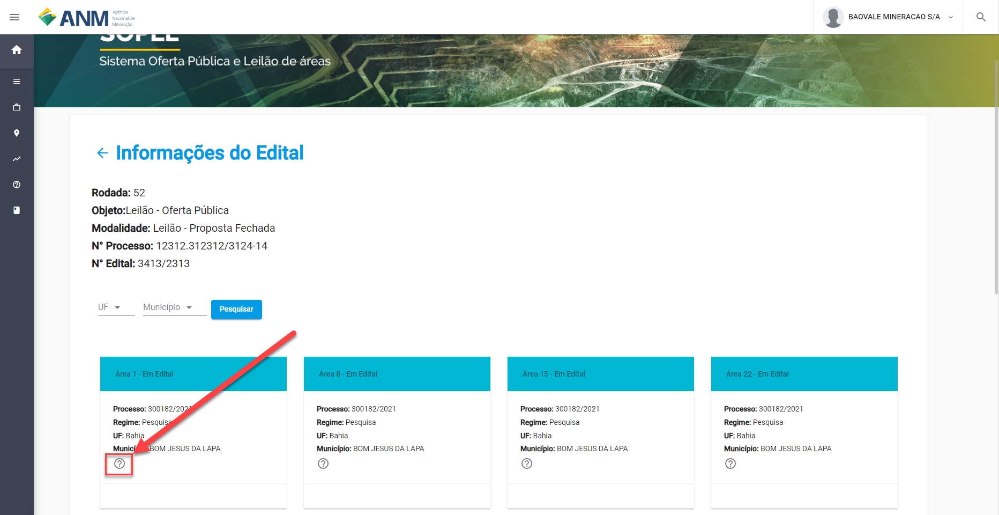

Da mesma forma que a lista de áreas, aqui são exibidas as informações sobre cada área em Oferta Pública como, Número do Processo (NUP) da área no SEI, Número do Processo Minerário, Área da Poligonal, Estado (UF) e Município na qual a área se encontra e o Regime de Disponibilidade. 

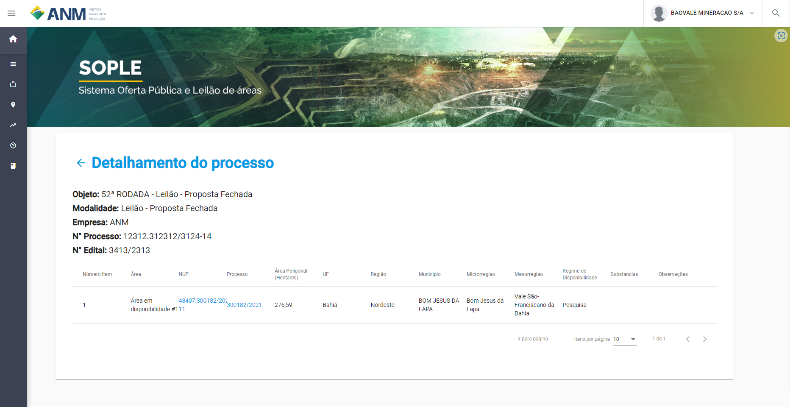

Clicando no Número do Processo Minerário o usuário será redirecionado para a página de Consulta do Cadastro Mineiro, na qual poderá informar o número do processo e consultar mais informações sobre o processo minerário relacionado a esta área.     

Como acessar o Registro de Interesse?
###################################################

O Registro de Interesse é a fase do edital onde fica disponível para os mineiradores indicarem o interesse nas áreas disponibilidas no edital.
Existem duas maneiras para o registro de interesse em uma área, sendo pelo Portal Público e pelo Portal do Mineirador.

Portal Público 
***************
Em Portal Público - Oportunidades / Detalhes / no card de **Oferta Pública** pelo link **Registrar Interesse**.

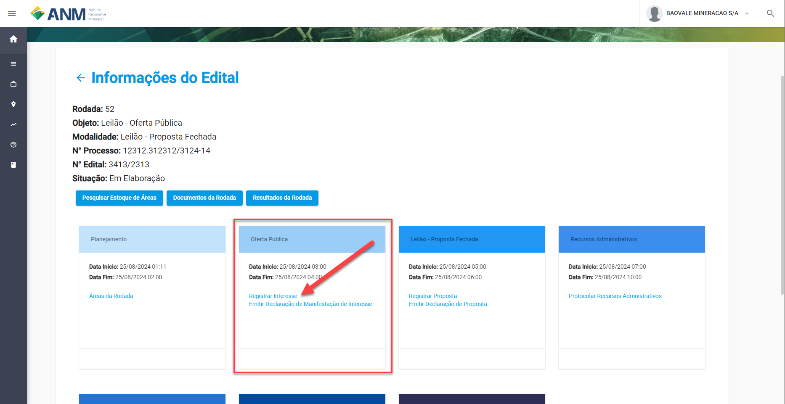

Ao clicar caso não tenha efetuado o login de acesso no sistema, será solicitado ao usuário realizar a autenticação (login) no Sistema SOPLE.

O usuário interessado deve realizar a autenticação no Sistema Escolhendo a opção "ENTRAR COM GOV.BR", conforme imagem abaixo.

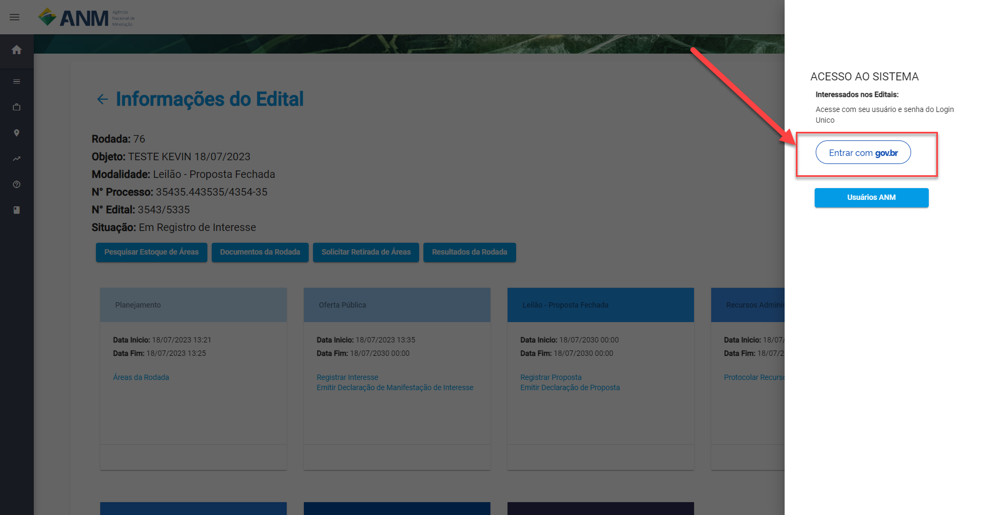

Portal do Mineirador
********************

- **Caso não esteja logado:**

Ao entrar no SOPLE e efetrar o login através do ícone de "cadeado" no topo da tela.
Efetuado o login de acesso no sistema, será solicitado ao usuário realizar a autenticação (login) no Sistema SOPLE.

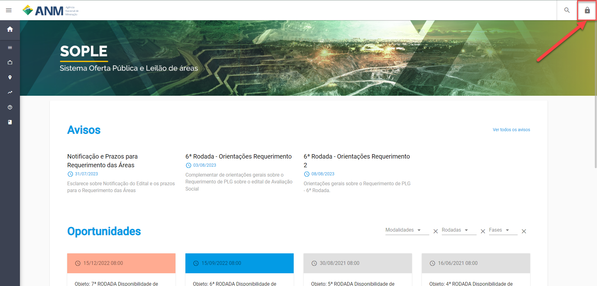

- **Caso esteja logado:**

Clique no nome no topo da tela e em seguida em Portal.

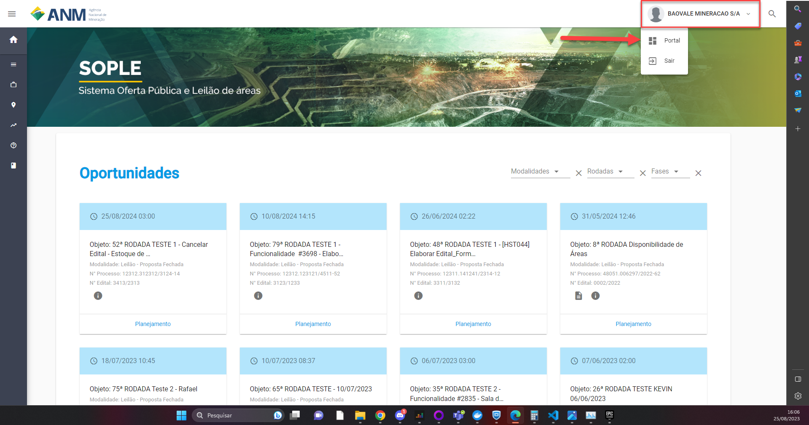

- Em seguida será redirecionado a tela de **Tarefas** do mineirador, nela caso exista um edital na fase de Registro de interesse, será apresentada a opção **Registro de Interesse** com todos os editais nesta fase.

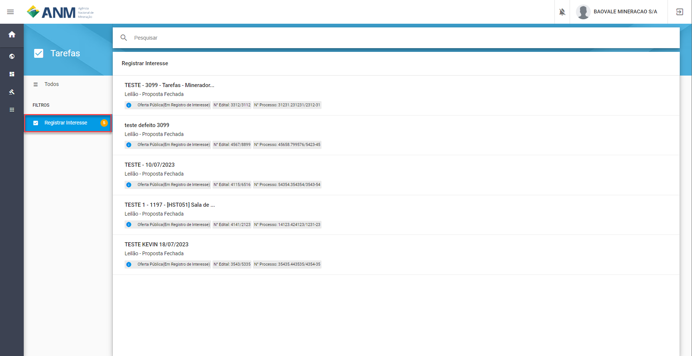

Como Registrar Manifestação de Interesse em Áreas?
###################################################

Nesta página são exibidas as áreas para que o usuário selecione as de seu interesse, conforme imagem a seguir.    
Obs.: Áreas com o status Removida, Retirada e Suspensa não podem receber interesse.

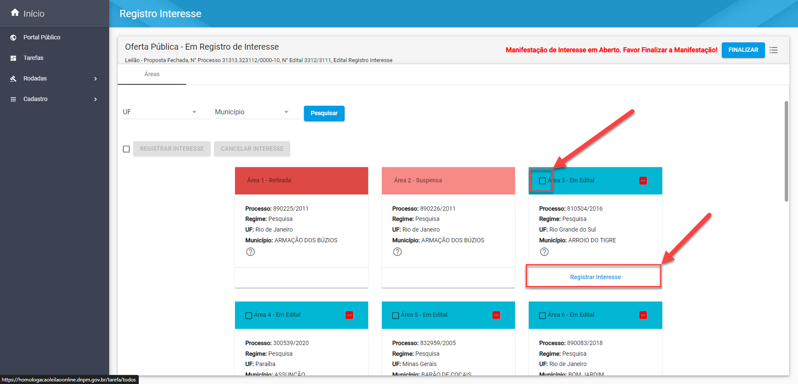

Caso o usuário clique no link "Registrar interesse" a área já vai estar vinculada ao interesse faltando somente a finalização, mas caso clique no checkbox do card, o botão "REGISTRAR INTERESSE" será habitado para que confirme a ação.

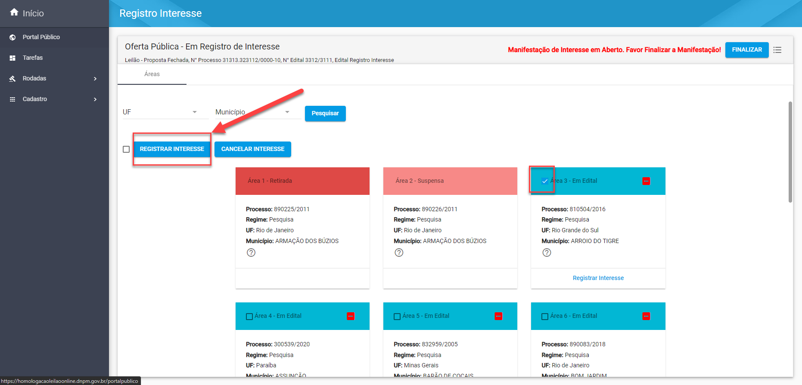

IMPORTANTE: Após Registrar a Manifestação de Interesse nas áreas o usuário deve clicar em "Finalizar", para Concluir o Registro da Manifestação de Interesse nas áreas Selecionadas. Conforme Imagem abaixo.
  
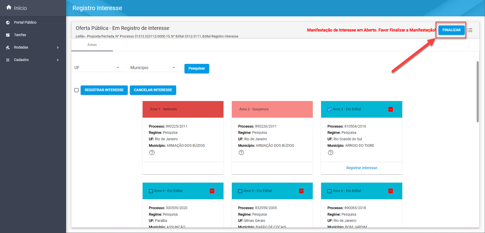

Como consultar Minhas Manifestações de Interesse?
###################################################
    
A funcionalidade "Minhas Manifestações" exibe a lista de áreas nas quais o usuário autenticado tem registro de Manifestação de Interesse. 
	
Seguindo os passos numerados na imagem abaixo o usuário conseguirá visualizar as áreas:
	
	1. Clique no ícone Superior Esquerdo para abertura do Menu Lateral;
	
	2. Selecione a opção "Processos" e depois "Meus Processos";
	
	3. Clique no Edital listado ao lado direito (Item 3 da imagem) para consultar as Manifestações de Interesse realizadas no Edital; 
		
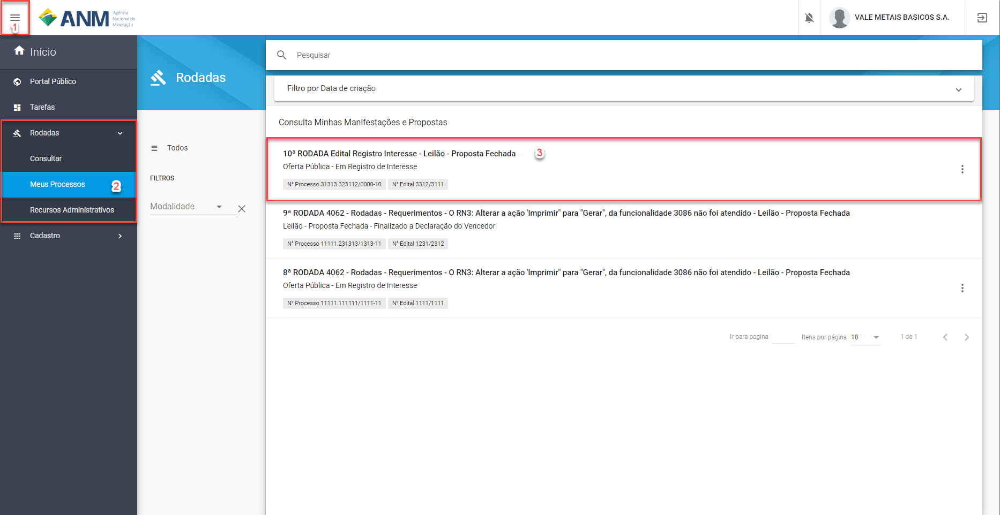

Nessa funcionalidade será possível identificar as áreas as quais foi registrado o interesse, o histórico de registros e gerar um documento autenticavel que representa o registro de interesse na área.

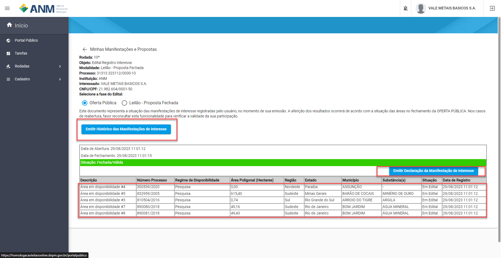

Como validar meu Registro de Interesse?
#######################################

Conformer visto anteriormente, hoje o sistem disponibiliza uma Declaração da Manifestação de Interesse, esse é um arquivo único da manifestação no edital, ou seja, para cada edital ou alteração nos registros de interesse do mesmo edital, 
o sistema vai gerar um arquivo correspontede com um código único e um QR Code que identifica sua participação.

1. Para conseguir este arquivo deve ser usar o botão "Emitir Declaração da Manifestação de Interesse" que vai emitir um PDF que deve ser quardado como um comprovante de participação.

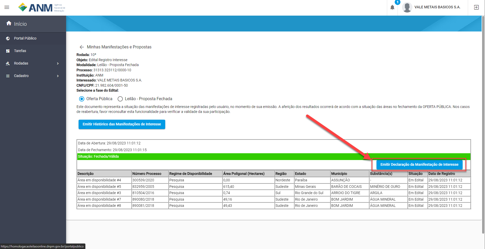

O documento será apresentado no seguinte modelo:

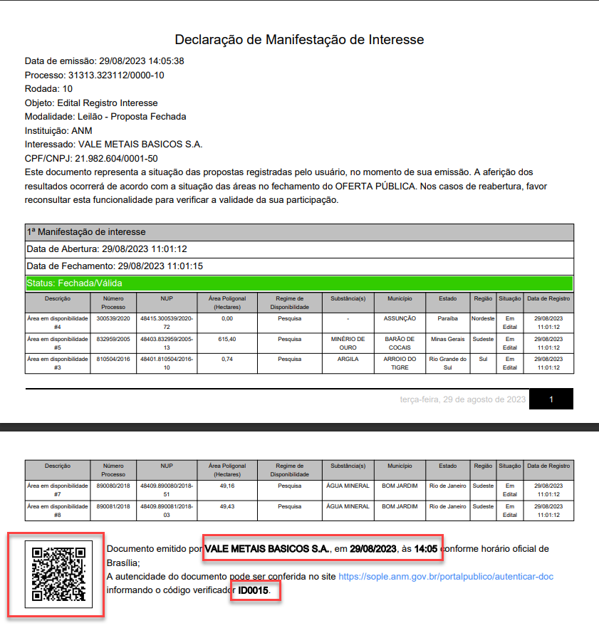

- **Veja que em destaque estão:**
    QR Code
    Empresa e hora de emissão do documento
    Identificador único do documenti composto de ID + código

2. Para acessar o validador entre no Portal Público e acesse o menu "Autenticar Documento", para acessar está tela e realizar a validação do documento não é necessário estar logado no sistema.

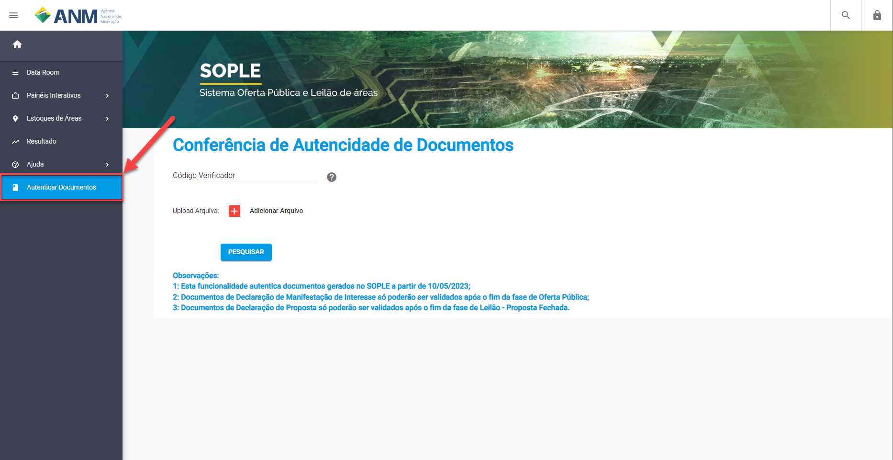

Neste recurso é possível validar o documento fazendo o Upload do mesmo ou informando o código único da Declaração da Manifestação de Interesse.

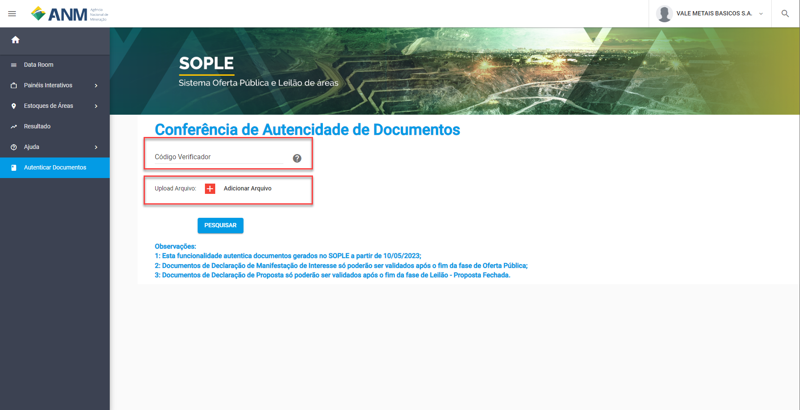

Caso o documento seja válido será apresentada uma mensagem como a seguir, que garante a autenticidade do processo.

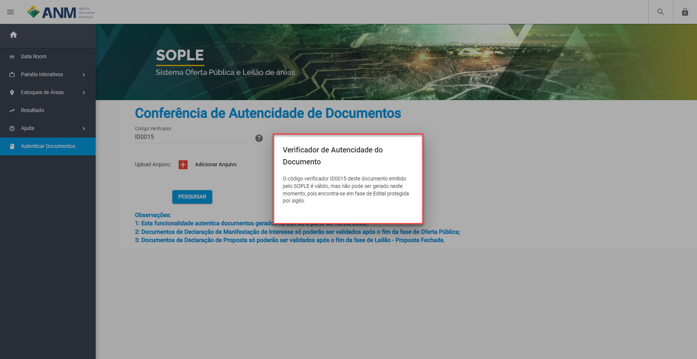