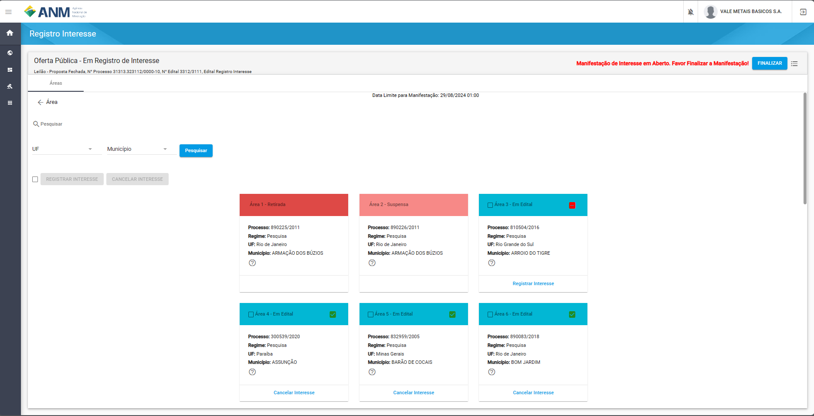
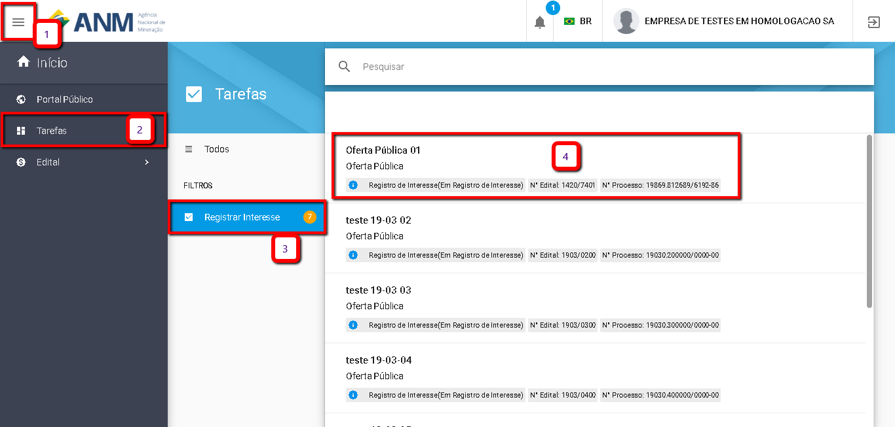
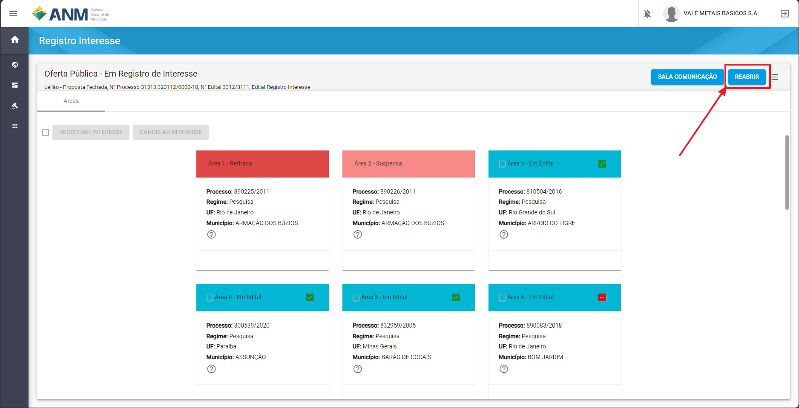
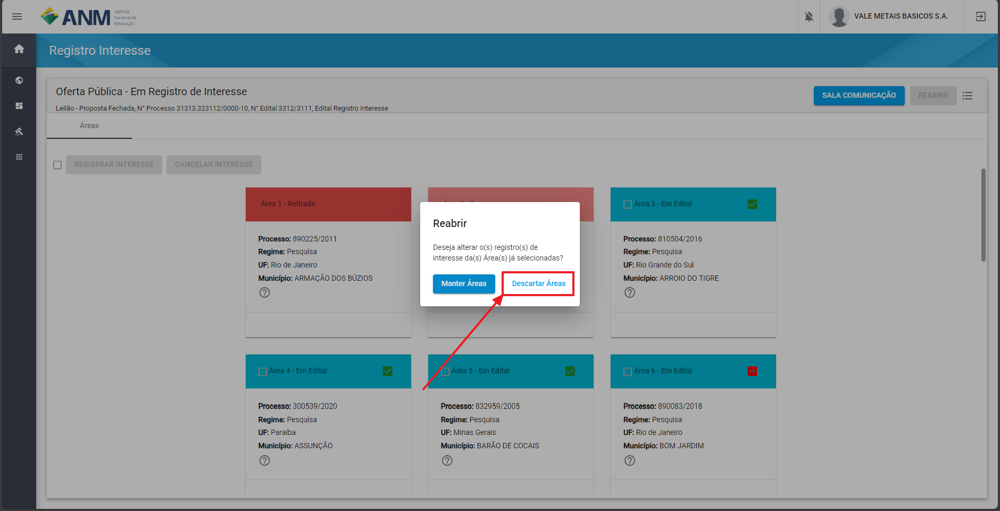
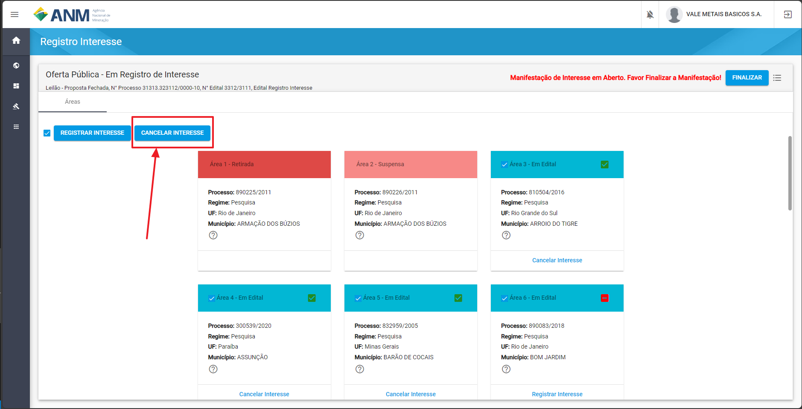
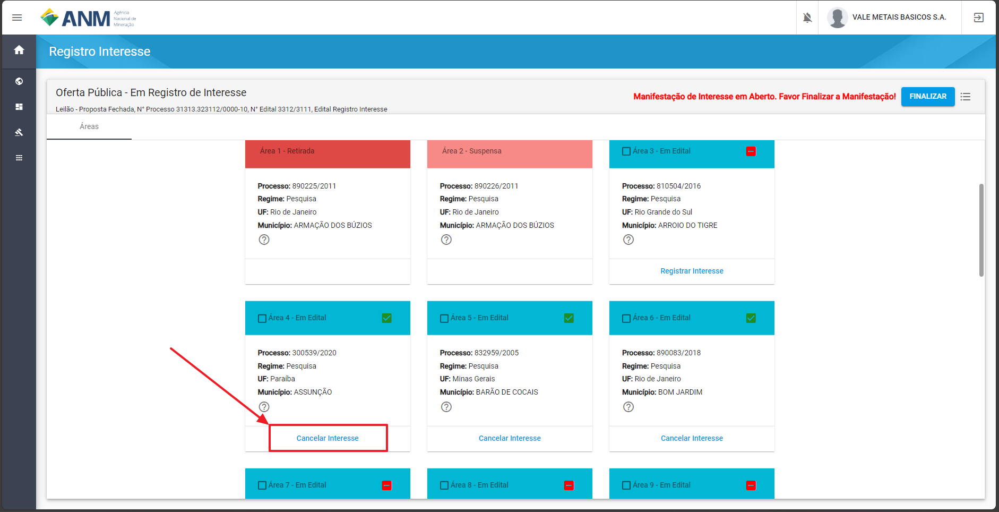
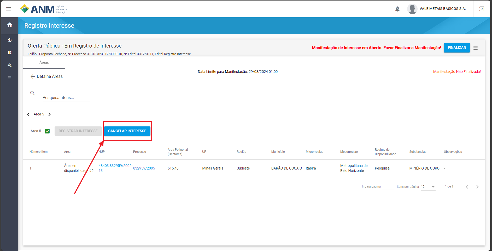

O que é o Registro de interesse?
================================
O Registro de Interesse é a etapa que ocorre na fase de Oferta Pública, na qual o interessado, via SOPLE, registra/indica em qual(is) área(s) tem interesse.
Somente depois de FINALIZAR esta etapa que o interessado estará participando da concorrência das áreas na rodada de disponibilidade.

Tela de registro:

O que é Manifestação de Interesse?
==================================
A Manifestação de Interesse é o conjunto de Registro de Interesse em área(s) realizado pelo usuário.

As situações da Manifestação de Interesse são:
- Aberta/Inválida – o interessado não finalizou a manifestação de interesse. Desse modo, não está apto a participar do processo de disponibilidade de áreas.
- Fechada/Válida – o interessado finalizou a manifestação de interesse. Desse modo, está apto a participar do processo de disponibilidade de áreas.

**IMPORTANTE: PARA O RESULTADO DA OFERTA PÚBLICA, SOMENTE SERÃO CONSIDERADAS AS MANIFESTAÇÕES DE INTERESSE COM A SITUAÇÃO/STATUS FECHADA/VÁLIDA!**

Perguntas frequentes sobre a etapa de Registro de Interesse (Manifestação de Interesse)
=======================================================================================

Nesse tópico estão reunidas as perguntas mais frequentes sobre o processo de Manifestação de Interesse nas áreas do Leilão.

Como saber quais são as Áreas da Rodada?
########################################

O sistema permite saber as áreas da rodada a partir do caminho Portal Público – Oportunidades / Detalhes / card Planejamento e link **Áreas da Rodada**.

**Portal Público - Informações do Edital**

.. image:: ../imagens/4.2CaminhoAcessoItensEdital.png

Ao clicar no link Áreas da Rodada, aparecerá Informações do Edital e a relação das áreas, disponibilizadas no referido Edital, através de cards.
 
.. image:: ../imagens/4.2PortalPublicodeAcessandoDetalhesEdital.png

Como ver os Detalhes das Áreas no Portal Público?
###################################################

Em cada card de área relacionada ao Edital, há um ícone **(?)** no qual é um link para mais detalhes da área.

.. image:: ../imagens/4.2DetalhesDaArea.png

Após clicar no ícone **(?)**, são exibidas mais informações como o número da área no edital, o NUP, o nº do processo minerário relacionado a esta área, o tamanho (em hectares) da poligonal, UF, o regime de disponibilidade, entre outras.

.. image:: ../imagens/4.2PortalPublicoDetalhesDeAreas.png

Clicando no Número do Processo Minerário o usuário será redirecionado para a página de Consulta do Cadastro Mineiro, na qual poderá informar o número do processo e consultar mais informações sobre o processo minerário relacionado a esta área.     

Como acessar o Registro de Interesse?
#####################################

Existem duas maneiras de acesso ao Registro de Interesse: pelo Portal Público e pelo Portal do Minerador.

Portal Público 
***************
Em Portal Público - Oportunidades / Detalhes / no card de **Oferta Pública** pelo link **Registrar Interesse**.

.. image:: ../imagens/4.2EditalRegistroInteresse.png

Ao clicar caso não tenha efetuado o login de acesso no sistema, será solicitado ao usuário realizar a autenticação (login) no Sistema SOPLE.

O usuário interessado deve realizar a autenticação no sistema escolhendo a opção "ENTRAR COM GOV.BR", conforme imagem abaixo.

.. image:: ../imagens/4.2SOPLEComoRegistrarManifestacaoDeInteresseEmAreas.png

Portal do Minerador
********************

- **Caso não esteja logado:**

Entrar no SOPLE e efetuar o login através do ícone de "cadeado" no topo da tela.
Efetuado o login de acesso no sistema, será solicitado ao usuário realizar a autenticação (login) no Sistema SOPLE.

.. image:: ../imagens/4.2Login.png

- **Caso esteja logado:**

Clicar no nome no topo da tela e em seguida em Portal.

.. image:: ../imagens/4.2AcessoPortalMineirador.png

- Em seguida será redirecionado a tela de **Tarefas** do minerador, nela caso exista um edital na fase de Registro de Interesse, será apresentada a opção **Registro de Interesse** com todos os editais nesta fase.

.. image:: ../imagens/4.2PortalMineiradorTarefasRegistroInteresse.png

Como Registrar Interesse em Áreas?
##################################

Na tela são exibidas as áreas e o usuário pode selecionar/registrar a(s) área(s) de seu interesse conforme a imagem a seguir.

Observação: Áreas com os status de Removida, Retirada e Suspensa não são possíveis de receber interesse.

.. image:: ../imagens/4.2SOPLEComoRegistrarManifestacaoDeInteresseEmAreas1SelecaoDeareas.png

Caso o usuário clique no link “Registrar Interesse”, a área já estará vinculada à manifestação faltando somente clicar em “FINALIZAR” para concluir a manifestação.

Caso o usuário clique no checkbox do card (imagem anterior), o botão “REGISTRAR INTERESSE” (imagem a seguir) será habilitado para que confirme a ação.

.. image:: ../imagens/4.2SOPLEComoRegistrarManifestacaoDeInteresseEmAreas2RegistrarInteresse.png

**IMPORTANTE: APÓS REGISTRAR INTERESSE NA(S) ÁREA(S), O USUÁRIO DEVE CLICAR EM “FINALIZAR” PARA CONCLUIR A MANIFESTAÇÃO DE INTERESSE! Vide a imagem a seguir.**
  
.. image:: ../imagens/4.2SOPLEComoRegistrarManifestacaoDeInteresseEmAreas3Finalizar.png

Como consultar Minhas Manifestações de Interesse?
#################################################
    
A funcionalidade "Minhas Manifestações" exibe a lista de áreas nas quais o usuário autenticado tem registro de Manifestação de Interesse. 
	
Seguindo os passos numerados na imagem abaixo o usuário conseguirá visualizar as áreas:
	
	1. Clicar no ícone Superior Esquerdo para abertura do Menu Lateral;
	
	2. Selecionar a opção "Rodadas" e depois "Meus Processos";
	
	3. Clicar no Edital listado ao lado direito (Item 3 da imagem) para consultar as Manifestações de Interesse realizadas no Edital;
		
.. image:: ../imagens/4.2SOPLEComoConsultarMinhasManifestacoesDeInteresse1ListaEditais.png

Nessa funcionalidade é(são) possível(is) de indetificar a(s) área(s) que foi(ram) registrada(s) o interesse, a(s) situação(ões) da(s) Manifestação(ões) de Interesse (Fechada/Válida ou Aberta/Inválida), a emissão de Histórico das Manifestações de Interesse e de Declaração da Manifestação de Interesse.

.. image:: ../imagens/4.2SOPLEComoConsultarMinhasManifestacoesDeInteresse2SalaDecomunicacao.png

Como validar Minha Manifestação de Interesse?
#################################################

Conforme descrito anteriormente, o sistema disponibiliza a Declaração da Manifestação de Interesse.

É um documento único de Manifestação de Interesse no qual para cada edital ou alteração nos registros de interesse o sistema gera um documento correspondente com um código único e um QR Code que identifica a participação do usuário.

1. Para gerar este documento, o usuário deve clicar em “Emitir Declaração da Manifestação de Interesse”. O documento gerado é o comprovante de participação.

.. image:: ../imagens/4.2EmitirDeclaracaoManifestacaoInteresse.png

O documento será apresentado no seguinte modelo:

.. image:: ../imagens/4.2DeclaracaoDeRegistroInteressePDF.png

- **Em destaque estão:**

QR Code, Empresa e hora de emissão do documento, Identificador único do documento composto de ID + código.

2. Caso o usuário queira verificar a autenticidade do documento gerado na etapa anterior, há a opção de conferência da autenticidade de documentos, através do botão “Autenticar Documentos”.

.. image:: ../imagens/4.2AutenticacaoDocumentoPortalPublico.png

Neste recurso é possível validar o documento fazendo o Upload do mesmo ou informando o código único da Declaração da Manifestação de Interesse.

.. image:: ../imagens/4.2AutenticacaoFormaValidacao.png

Caso o documento seja válido será apresentada uma mensagem como a seguir, que garante a autenticidade do processo.

.. image:: ../imagens/4.2DocumentoValidoFaseRegistroInteresse.png

Como Reabrir Minha Manifestação de Interesse?
#############################################

A funcionalidade de Reabrir Manifestação de interesse fica disponível após "Finalizar" a Manifestação de Interesse. 
    
Esta funcionalidade é utilizada nos casos em que o usuário já "Finalizou" a sua Manifestação de Interesse mas deseja alterá-la:

	1. Para selecionar/registrar nova(s) área(s) de Interesse em sua Manifestação; E/OU
	
	2. Cancelar/Retirar alguma(s) área(s) da Manifestação de Interesse dentro do prazo da etapa de Registro de Interesse e fase Oferta Pública indicado no edital.

Seguindo os passos numerados na imagem abaixo o usuário conseguirá Reabrir sua Manifestação de Interesse:
	
	1. Clicar no ícone Superior Esquerdo para abertura do Menu Lateral;
	
	2. Selecionar a opção "Tarefas";
	
	3. Selecionar "Registrar Interesse" no menu intermediário;
	
	4. Selecionar o Edital.

No caso do usuário já ter finalizado sua Manifestação de Interesse, o botão "Reabrir" estará visível para que seja possível a reabertura da sua Manifestação de Interesse, conforme imagem abaixo.

**IMPORTANTE: LEMBRE-SE DE “FINALIZAR” A MANIFESTAÇÃO DE INTERESSE APÓS A REABERTURA. SOMENTE SÃO CONSIDERADAS AS MANIFESTAÇÕES DE INTERESSE COM A SITUAÇÃO/STATUS FECHADA/VÁLIDA!**

Como Cancelar Minha(s) Manifestação(ões) de Interesse?
######################################################

A funcionalidade "Cancelar" Manifestação de Interesse fica disponível enquanto o usuário não "Finalizar" a Manifestação de Interesse.

Caso o usuário tenha Finalizado a Manifestação de Interesse, faz-se necessário "Reabrir" a Manifestação de Interesse para realizar o cancelamento. 
    
O “Cancelar Manifestação de Interesse” em alguma(s) área(s) é utilizado no caso de 0 usuário ter Registrado o Interesse em alguma(s) área(s) e desejar cancelar/retirar/alterar este Registro de Interesse dentro do prazo da etapa de Registro de Interesse na fase de Oferta Pública.

Na tela de Registro de Interesse existem várias formas de cancelar o interesse, sendo:

- *Reabrir e aceitar a mensagem para remover interesses das áreas*:
    Ao clicar em “REABRIR”, o sistema apresenta a mensagem “Deseja alterar o(s) registro(s) de interesse da(s) Área(s) já selecionadas?” e com duas opções: Manter Áreas ou Descartar Áreas. Se o usuário selecionar a opção Descartar Áreas, todas as áreas, antes selecionadas, não estarão mais registradas como interesse.

- *Botão "Cancelar Interesse"*
    Ao marcar a caixa ao lado dos botões de controle e clicar em **CANCELAR INTERESSE**, o sistema vai cancelar o interesse em todas as áreas que estão selecionadas como registro de interesse.

- *Botão "Cancelar Interece" do card da Área*
    Em cada card em que for registrado o interesse existe um botão na parte inferior do card para que seja possível cancelar o interesse dessa área.

    
- *Detalhe da Área botão "CANCELAR INTERESSE"*
    Ao entrar em detalhe da área  clicar em “Cancelar Interesse” no card, é aberta uma nova visualização com mais detalhes da área e apresentando o botão “Cancelar Interesse” novamente.

**IMPORTANTE: DEVE-SE SEMPRE “FINALIZAR” A MANIFESTAÇÃO DE INTERESSE PARA CONSIDERÁ-LA COMO VÁLIDA!
A SITUAÇÃO DA MANIFESTAÇÃO DE INTERESSE PODE SER VERIFICADA NA FUNCIONALIDADE “MINHAS MANIFESTAÇÕES” E NA DECLARAÇÃO DE MANIFESTAÇÃO DE INTERESSE.**
