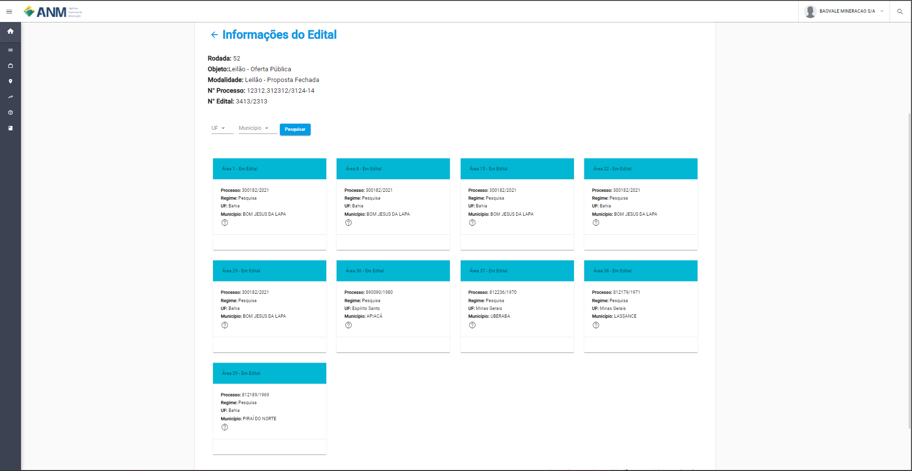

Como saber quais áreas estão disponíveis no Edital?
==================================================
Atualmente o sistema permite encotnrar as áreas que estão disponiveis para o edital atráves do caminho Edital / Detalhes / no card de **Planejamento** pelo link do card **Áreas da Rodada**.

**Portal Público - Informações do Edital**
.. image:: ../imagens/4.2CaminhoAcessoItensEdital.png

A página de Detalhes do Edital de oferta pública exibe informações básicas do Edital, como Objeto, a Modalidade, o Número do Processo SEI (NUP) e o Número do Edital. 

Além destas informações, são listadas as áreas contidas neste edital.
 

