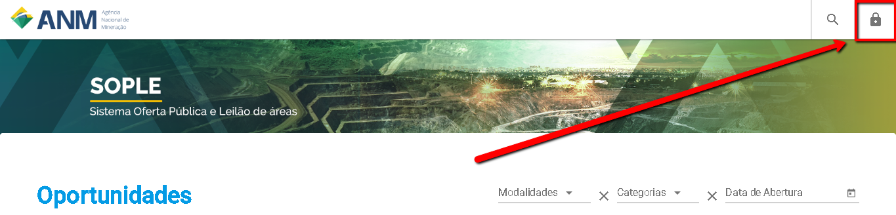
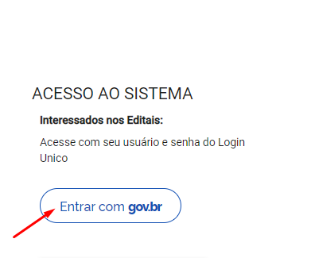

Como informar meus Dados Cadastrais?
===================================

Acesse o endereço eletrônico:  https://sople.anm.gov.br

Ao realizar a autenticação no sistema você será Direcionado para a tela de Dados cadastrais. 

  1. Clique no cadeado no canto superior direito, para ter acesso ao gov.br. 

Clique em entrar com gov.br. 
