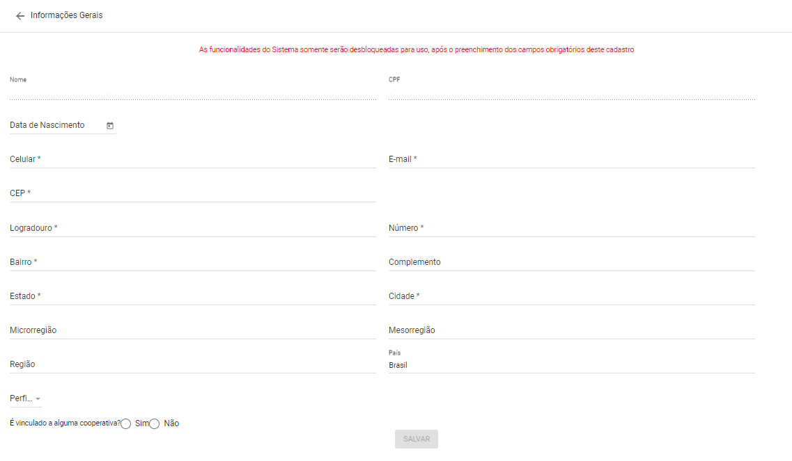
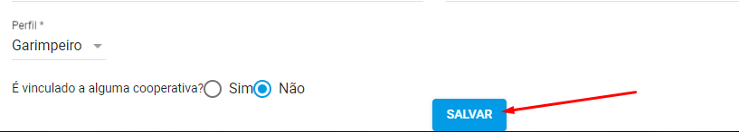

Como informar meus Dados Cadastrais?
===================================

Acesse o endereço eletrônico:  https://sople.anm.gov.br

Ao realizar a autenticação no sistema você será Direcionado para a tela de Dados cadastrais. 

Clique no cadeado no canto superior direito, para ter acesso ao gov.br. 

.. image:: ../imagens/Screenshot_5.png
Clique em entrar com gov.br. 

Primeiro acesso
=============================================

Ao informar o seu *login* e *senha* no portal **gov.br**, você será redirecionado para a pagina de informações gerais.  
    
Nesta página deverá ser preenchido os seguintes quesitos:

	1. Nome completo e CPF;
	2. Data de nascimento;  
  3. Telefone para contato e E-mail.
  4. Informar dados completos de endereço pessoal ou empresarial se for o caso;
  5. Informar o seu tipo de perfil cadastral, sendo este garimpeiro ou minerador; 
  6. Informar se faz este perfil em questão está vinculado a uma corporativa;

Somente após preencher todos os dados da página de modo devido, irá aparecer a opção de salvar.

Assim dando acesso as demais areas do site.
