Leilão - Proposta Fechada
=========================

Fase aplicável somente às áreas que são objeto de mais de uma manifestação de interesse na fase de Oferta Pública e de maneira exclusiva aos participantes que manifestaram interesse para esta(s) respectiva(s) área(s) na fase de Oferta Pública. Nesta fase, estes participantes podem “Registrar Proposta” e emitir a Declaração de Proposta.

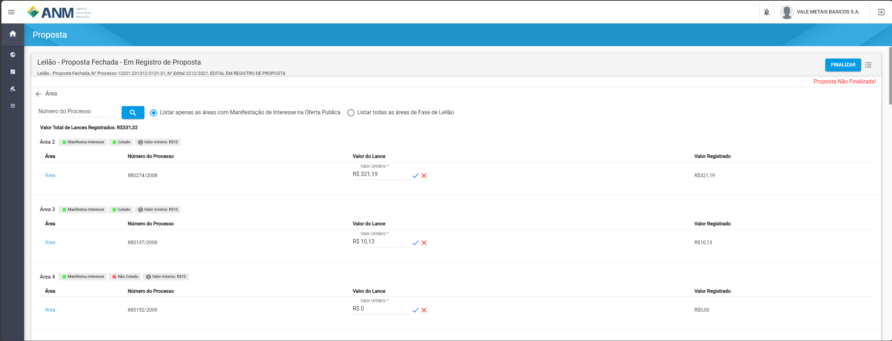

Perguntas frequentes sobre a fase Leilão - Proposta Fechada
===========================================================

Nesse tópico estão reunidas as perguntas mais frequentes sobre a fase Leilão - Proposta Fechada.

Como encontrar o Leilão para fazer a Proposta (Lance) na área?
##############################################################

Após autenticar no SOPLE com sua conta do Login Único, escolha o usuário com o qual registrou a Manifestação de Interesse. 

Selecione "Tarefas" no menu esquerdo principal, conforme imagem;

Na lista de "Tarefas" são exibidos filtros para Editais em função da ação que o usuário deseja fazer em cada Edital;

No lado direito são exibidos os Editais, entre o menu principal e a lista de editais são exibidos os filtros de Editais.

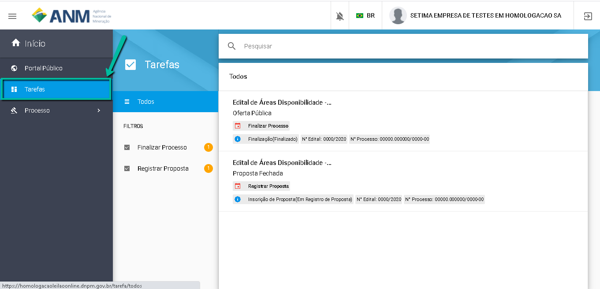

Selecione "Registrar Proposta", item 1 da imagem abaixo, para filtrar os Editais que se encontram no período de Registro de Proposta. 

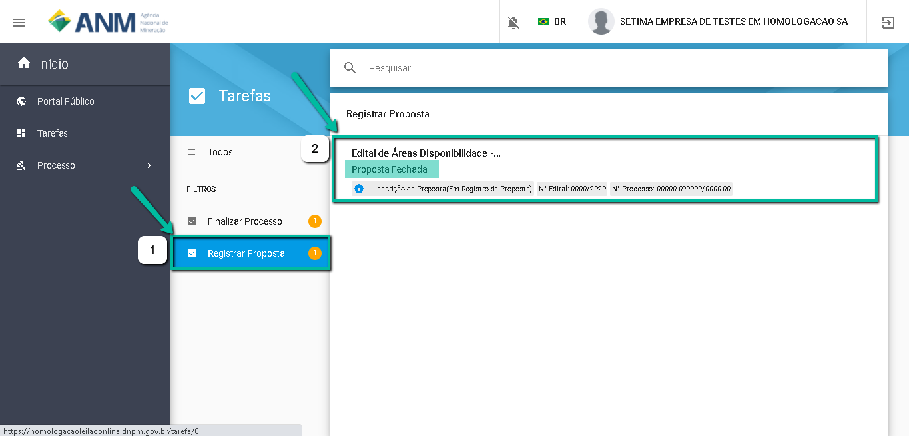

Clique no Edital, item 2 da imagem acima, para ir para a Funcionalidade de "Inscrição de Proposta". 

Como Registrar a Proposta para uma Área?
########################################

Na funcionalidade de "Inscrição de Proposta", no campo "Valor da Proposta", informe o valor da Lance a ser considerado para tentar ganhar o direito de requerer a área com prioridade, conforme as regras do Edital.  

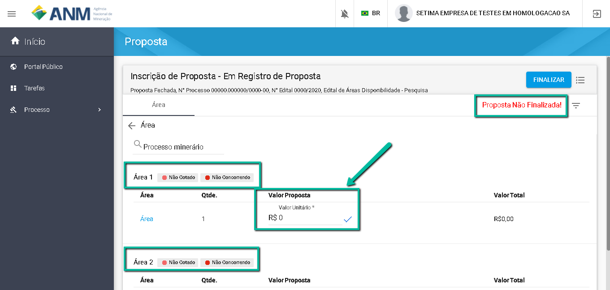

Ao informar o valor da proposta, observe a situação da área "Não Cotado" (em vermelho) mudará para "Cotado" (em verde). 

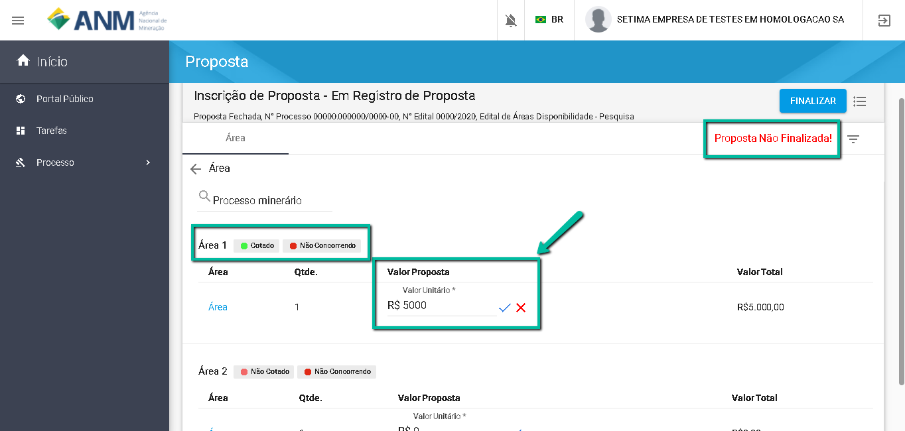

Após Clicar em "Finalizar", observe que a situação "Não Concorrendo" (em vermelho) mudará para "Concorrendo" (em verde). 

O usuário será redireciondo para a funcionalidade de "Sala de Comunicação", onde poderá acompanhar a situação da sua proposta após o término do prazo de envio de proposta. 

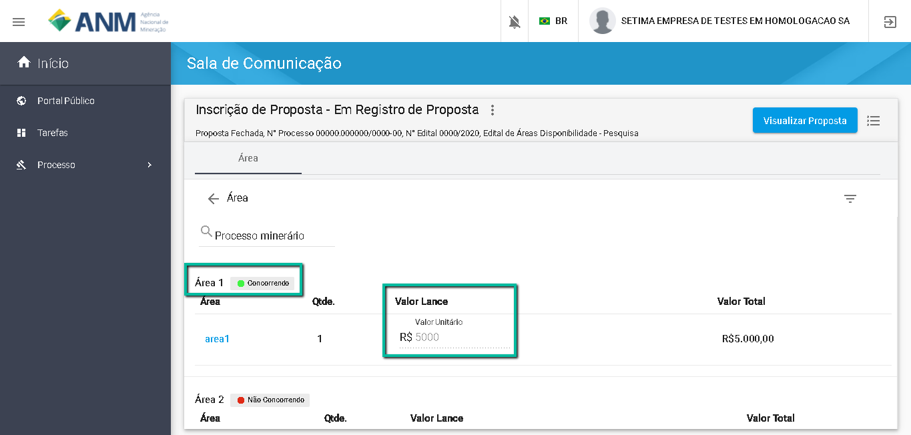

**IMPORTANTE: O USUÁRIO SOMENTE PODE INSCREVER PROPOSTA NA(S) ÁREA(S) EM QUE MANIFESTOU INTERESSE NA FASE DE OFERTA PÚBLICA!**

É possível Registrar uma nova Proposta em uma Área?
###################################################

Sim. Basta acessar novamente a funcionalidade de "Inscrição de Proposta" e informar um novo valor de Proposta (Lance). 
Lembre-se de "Finalizar" a proposta para garantir que está concorrendo. 

Caso o usuário já tenha "Finalizado" o envio de suas propostas, é possível "Reabrir" para envio de nova propostas, desde que esteja dentro do prazo de recebimento de propostas estipulado no Edital. 

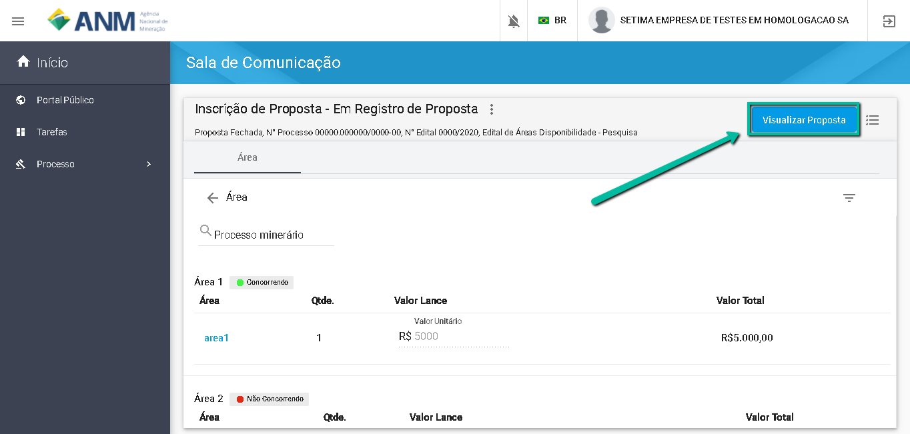

Para "Reabrir", selecione "Visualizar Propostas" e depois clicar em "Reabrir".
A funcionalidade de "Inscrição de Proposta" será habilitada novamente para envio de nova propsota. 

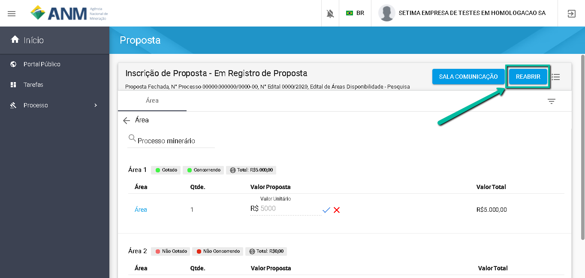

**IMPORTANTE:**
1. O USUÁRIO SOMENTE PODE INSCREVER PROPOSTA NA(S) ÁREA(S) EM QUE MANIFESTOU INTERESSE NA FASE DE OFERTA PÚBLICA!

2. APÓS REABRIR AS PROPOSTAS E REALIZAR AS ALTERAÇÕES, LEMBRE-SE DE **FINALIZAR** NOVAMENTE PARA QUE AS PROPOSTAS SEJAM VÁLIDAS E CONCORRENDO!

Como consultar Minhas Propostas?
################################
Para se consultar as propostas de lances feitos em um edital o usuário deve abrir o edital pelo Portal Público estando devidamente autenticado no SOPLE.

No card **Leilão - Proposta Fechada** clicar no link **Emitir Declaração de Proposta**.

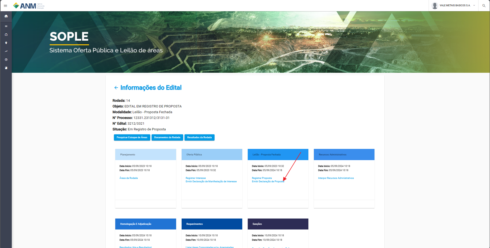

Ao entrar no recurso clique na opção **Leilão - Proposta Fechada**.

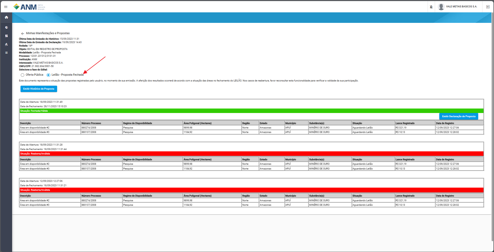

Nessa tela estaram as propostas válidas e inválidas.

Como consultar o Histórico de Propostas?
########################################
Além de todos os registros de Proposta serem apresentados na tela Minhas Manifestações e Proposta, também é possível criar o arquivo com o histórico de todoas as propostas feitas.
Conforme a imagem clique no botão "Emitir Histórico de Proposta".

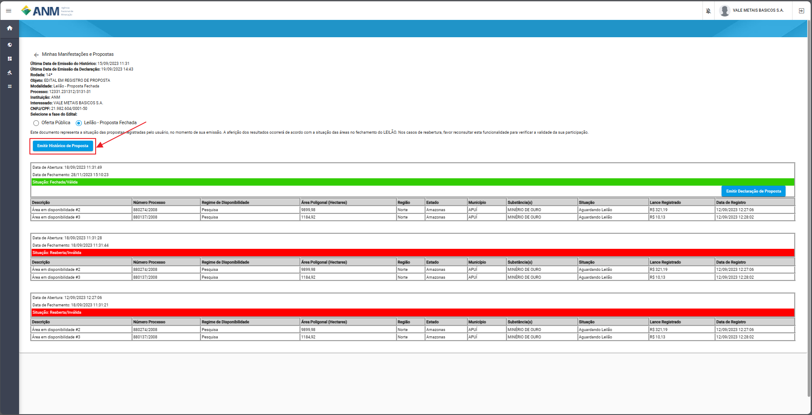

Nesse momento o sistema vai gerar um arquivo PDF que não tem validade probatória, mas desta todos os valores de lances, áreas e dados do edital da proposta.

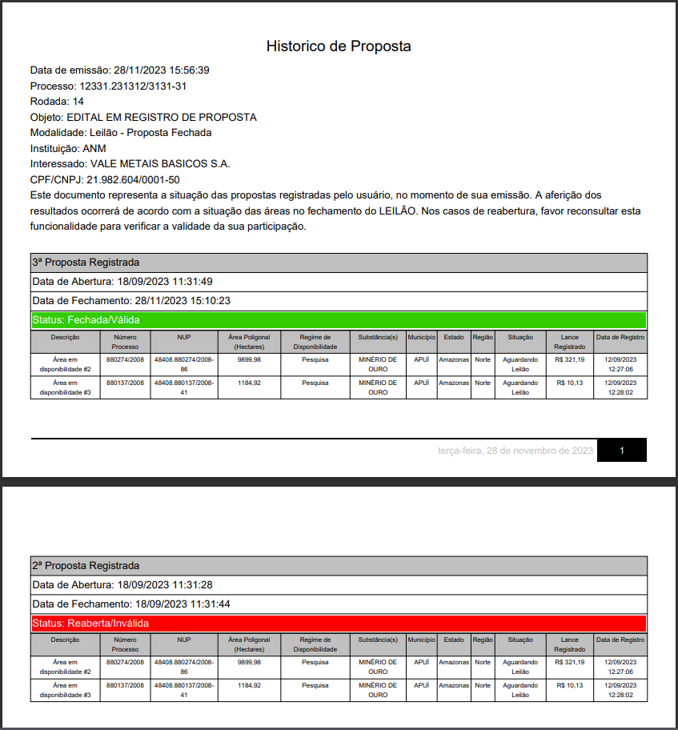

Como validar Minhas Propostas?
##############################
Conforme descrito anteriormente, o sistema disponibiliza a Declaração da Proposta.

É um documento único no qual para cada edital ou alteração nos registros de proposta o sistema gera um documento correspondente com um código único e um QR Code que identifica a participação do usuário.

1 - Para gerar este documento deve clicar em “Emitir Declaração Proposta” e o usuário pode guardar como um comprovante de participação.

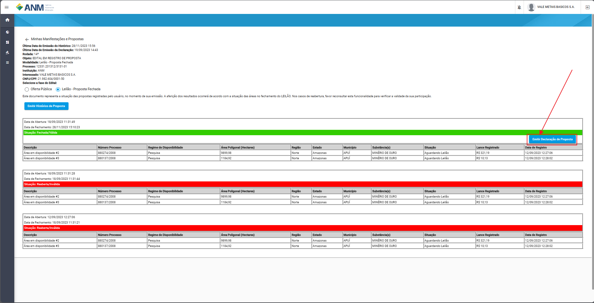

O documento será apresentado no seguinte modelo:

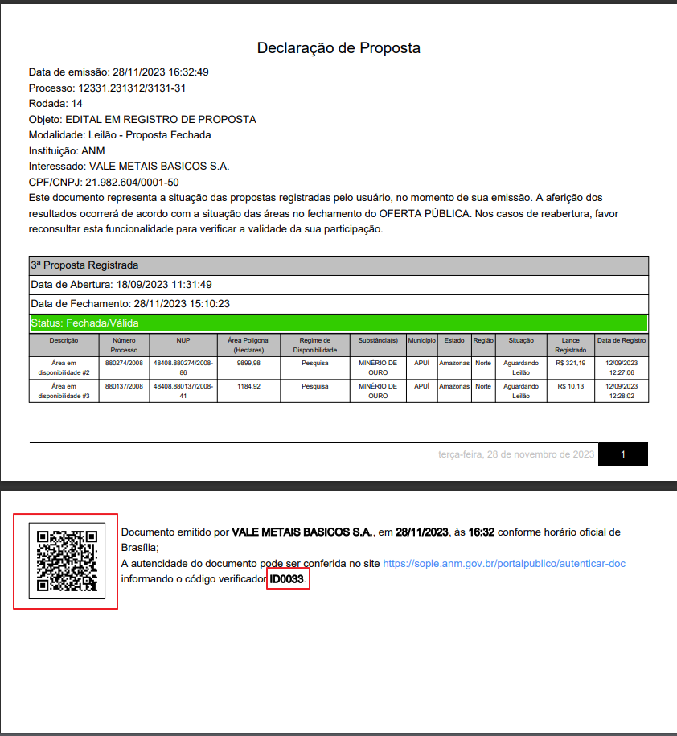

2 - Para acessar o validador, entre no Portal Público e acesse o menu “Autenticar Documento”. Não é necessário estar logado no sistema para acessar esta tela e realizar a validação do documento.

.. image:: ../imagens/4.2AutenticacaoDocumentoPortalPublico.png

Neste recurso é possível validar o documento fazendo o Upload do mesmo ou informando o código único da Declaração da Proposta.

.. image:: ../imagens/4.2AutenticacaoFormaValidacao.png

Caso o documento seja válido será apresentada uma mensagem informando a validade do documento.