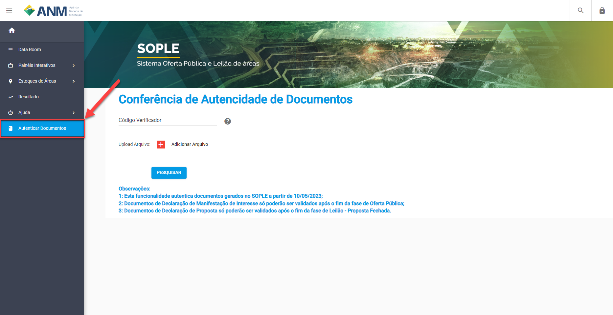

Leilão - Proposta Fechada
=========================

Fase aplicável somente às áreas que são objeto de mais de uma manifestação de interesse na fase de Oferta Pública e de maneira exclusiva aos participantes que manifestaram interesse para esta(s) respectiva(s) área(s) na fase de Oferta Pública.
Na fase de Leilão, estes participantes podem “Registrar Proposta” e emitir a Declaração de Proposta.

.. image:: ../imagens/7.1TelaPropostaFechadaLances.png

Perguntas frequentes sobre a fase Leilão - Proposta Fechada
===========================================================

Nesse tópico estão reunidas as perguntas mais frequentes sobre a fase Leilão - Proposta Fechada.

Como encontrar o Leilão para fazer a Proposta (Lance) na área?
##############################################################

Após autenticar no SOPLE com sua conta do Login Único do GOV.BR, escolher o usuário com o qual foi registrada a Manifestação de Interesse.

Selecionar "Tarefas" no menu esquerdo principal, conforme imagem;

Na lista de "Tarefas" são exibidos filtros para Editais em função da ação que o usuário deseja fazer em cada Edital;

No lado direito da tela, são exibidos os Editais, entre o menu principal e a lista de editais são exibidos os filtros de Editais.

.. image:: ../imagens/7.1TelaMenuTarefas.png

Selecionar "Registrar Proposta", item 1 da imagem abaixo, para filtrar os Editais que se encontram no período de Registro de Proposta.

Clicar no Edital, item 2 da imagem acima, para ir para a Funcionalidade de "Inscrição de Proposta".

Como Registrar a Proposta para uma Área?
########################################

Na funcionalidade de "Inscrição de Proposta", no campo "Valor da Proposta", informar o valor do Lance a ser considerado para concorrer ao direito de requerer a área com prioridade, conforme as regras do Edital.
Para que o Lance seja considerado Válido o mesmo tem que ter o valor superior igual ou superior ao **Valor mínimo** e estar marcado como **Cotado (em verde)**. Caso ao sair do campo **Valor do Lance** e o marcardor não for alterado para Cotado deve ser pressionado o botão **Registrar proposta do item** que fica ao lado do campo.

Para não concorrer a uma área em que o lance foi feito e ficou como Cotado, é necessário clicar no botão **Alterar lote para não cotato**, o sistema vai manter o valor informado, mas vai lançar o status como **Não Cotado (Em vermelho)**.

Ao clicar em **Finalizar** usuário será redirecionado para a funcionalidade de "Sala de Comunicação", onde poderá acompanhar a situação da sua proposta após o término do prazo de envio de proposta.

**IMPORTANTE: O USUÁRIO SOMENTE PODE INSCREVER PROPOSTA NA(S) ÁREA(S) EM QUE MANIFESTOU INTERESSE NA FASE DE OFERTA PÚBLICA!**

É possível registrar uma nova Proposta em uma Área?
###################################################

Sim, basta retorar ao recurso de **Registrar Proposta** nos detalhes do Leilão ou pela tela de Tarefas no Portal.
Lembrar de "Finalizar" a proposta para garantir que estará concorrendo.

Para reabrir a proposta clique no botão **Reabrir**. Nesse momento os lances já registrados se manteram podendo ser descartdos ou novos lances podem ser feitos.

**IMPORTANTE:**

1. O USUÁRIO SOMENTE PODE INSCREVER PROPOSTA NA(S) ÁREA(S) EM QUE MANIFESTOU INTERESSE NA FASE DE OFERTA PÚBLICA!

2. APÓS REABRIR AS PROPOSTAS E REALIZAR AS ALTERAÇÕES, LEMBRE-SE DE **FINALIZAR** NOVAMENTE PARA QUE AS PROPOSTAS SEJAM VÁLIDAS E ESTEJA CONCORRENDO!

Como consultar Minhas Propostas?
################################
Para consultar as propostas de lances feitos em um edital o usuário deve abrir o edital pelo Portal Público estando devidamente autenticado no SOPLE.

No card **Leilão - Proposta Fechada** clicar no link **Emitir Declaração de Proposta**.

.. image:: ../imagens/7.1LeilaoPropostaFechadaHistorico.png

Ao entrar no recurso clicar na opção **Leilão - Proposta Fechada**.

.. image:: ../imagens/7.3propostas.png

Nessa tela estarão as propostas válidas e inválidas.

Como consultar o Histórico de Propostas?
########################################
Além de da tela “Minhas Manifestações e Propostas” apresentar todos os registros de Proposta serem apresentados na tela Minhas Manifestações e Proposta,
também é possível criar o arquivo com o histórico de todoastodas as propostas feitas. Conforme a imagem abaixo, clique clicar no botão “Emitir Histórico de Proposta”

.. image:: ../imagens/7.3propostasBotaoHistorico.png

Nesse momento, o sistema vai gerará um arquivo PDF (que não tem validade probatória,) mas destaque apresenta todos os valores de lances,
áreas e dados do edital da(s) proposta(s), incluindo seus status (Fechada/Válida e Aberta/Inválida).

.. image:: ../imagens/7.3DocumentoHistorico.png

Como validar Minhas Propostas?
##############################
Conforme descrito anteriormente, o sistema disponibiliza a Declaração da Proposta.

É um documento único no qual para cada edital ou alteração nos registros de proposta o sistema gera um documento correspondente com um código único e um QR Code que identifica a participação do usuário.

1 - Para gerar este documento deve clicar em “Emitir Declaração Proposta” e o usuário pode guardar como um comprovante de participação.

.. image:: ../imagens/7.3BotaoDeclaracao.png

O documento será apresentado no seguinte modelo:

.. image:: ../imagens/7.3PDFDeclaracao.png

2 - Para acessar o autenticador, entrar no Portal Público e clicar o menu “Autenticar Documento”. Não é necessário estar logado no sistema para acessar esta tela e realizar a validação do documento.

Neste recurso é possível validar o documento fazendo o Upload dele ou informando o código único da Declaração da Proposta.

.. image:: ../imagens/4.2AutenticacaoFormaValidacao.png

Caso o documento seja válido será apresentada uma mensagem informando a validade do documento.

.. image:: ../imagens/4.2DocumentoValidoFaseRegistroInteresse.png