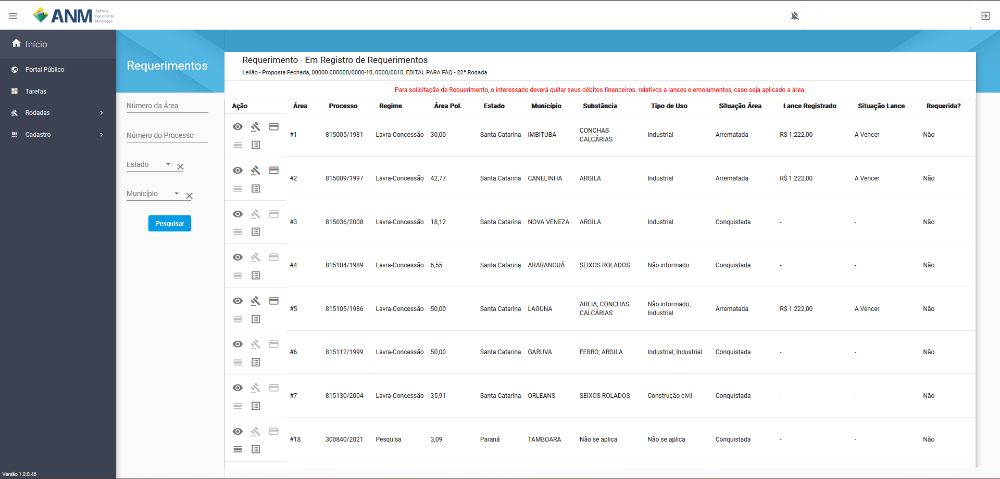

Requerimento de áreas do Leilão Proposta Fechada
================================================
Fase de pagamento é realizada pelos usuários após ao fim da fase de Homologação e Adjudicação, onde o SOPLE ao receber a confirmação do pagamento permite o início do processo.

Assim como o Pagamento, o acesso ao  **Requerimento** será:

**Portal Público:**

    Acessando os Detalhes do Edital, card de Requerimento, em **Listar áreas Conquistadas e/ou Arrematadas**.

    .. image:: ../imagens/10.RequerimentoPortalPublico.png

**Painel do Minerador:**

    Acessando em Portal do Minerador, Rodadas, Requerimentos, Edital em Requerimento.

    .. image:: ../imagens/10.TelaRequerimentoPainel.png

**Observação:** Em ambas as opções a possibilidade de fazer o pagamento de Lance e Emolumentos fica atrelada a fase do edital, que deve estar na situação **"Em Registro de Requerimentos"**.

Página de Requerimentos:

Filtros

    - **Número da Área:** campo utilizado para pesquisa de uma área pelo seu identificador no edital.
    - **Número do Processo:** campo utilizado para pesquisa de um Processo específico, no formato reduzido (formato XXX.XXX/AAAA) no Estoque de Áreas do SOPLE.
    - **Estado:** possibilita a busca de Processos a partir da Unidade da Federação nos quais estes foram gerados.
    - **Município:** possibilita a busca de Processos a partir dos municípios da Unidade da Federação selecionada anteriormente.

Após a confirmação dos pagamentos de Lances e Emolumentos, ou caso a área tenha sido conquistada, será habilitado o botão "Requerimentos" (:fa:`fa-solid fa-list-alt`).

**Observação:** Nesta etapa o cadastro do SDC é obrigatório.

Tipos de Áreas e processos de requerimento?
===========================================

Lavra-Concessão
###############

**- O que é?**

A concessão de lavra é um título mineral que permite o uso e a lavra de bens públicos, permitindo a apropriação dos recursos minerais após a extração.

**- Áreas Conquistadas e Arrematadas no Edital:**

Conforme o andamento do edital, áreas conquistadas na fase de Oferta Pública serão disponibilizadas sem a necessidade de pagamento.
Ao entrar na tela de requerimento na fase, o botão **Requerimentos** estará habilitado permitindo iniciar o requerimento.

Para uma área que foi  **Arrematada** o retorno do sistema de pagamento deve ter ocorrido, com isso na coluna **Situação do Lance** estará com a situação **Pago** e o botão **Requerimentos** estará habilitado.

**- Requerimento da área**

Nesta etapa sendo **Arrematado** ou **Conquistado** tem uma sequência de finalização semelhante.
O processo de requerimento de Lavra-concessão pode ter de 4 a 5 passos, sendo o maior número de passos no caso de uma área **Arrematada**.

**1 - São apresentados os dados como:**

    - **Rodada:** campo que corresponde ao número da rodada do edital em que está sendo feita a solicitação.
    - **Objeto:** campo que corresponde ao objetivo a ser atingido com o edital.
    - **Modalidade:** campo que corresponde a modalidade do edital.
    - **Nº do Processo:** campo que corresponde ao número do processo SEI correspondente a rodada.
    - **Nº da Área:** campo que corresponde a área do edital no qual pretende interpor recurso.
    - **Período de Requerimento:** campo que corresponde ao período em que o usuário/participante pode criar um requerimento para a área.

    Nesse momento fica habilitado o botão **+ Solicitar Requerimento**

    .. image:: ../imagens/8.LavraConcecaoInicio.png
    
    Ao clicar o sistema reforçará a necessidade de ter o cadastro atualizado no SDC(Sistema de Dados Cadastrais), para o requerimento da área.

    .. image:: ../imagens/8.LavraConcecaoAlertaSDC.png
    

**2 - Dados do Requerente:**

    Apresenta todos os dados que serão utilizados para o requerimento referente ao requerente. 
    Esses dados podem ser alterados via atualização no SDC(Sistema de Dados Cadastrais), lembrando que a atualização dessas informações podem levar até 24 horas para serem efetivadas.
           
    .. image:: ../imagens/8.DadosRequerenteLavraConcessao.png
    

**3 - Dados de pagamento:**

    Caso a área tenha sido **Arrematada**, o valor do pagamento do lance será apresentando para conferência.

    .. image:: ../imagens/8.DadosPagamentoRequerimento.png

**4 - Dados da Área:**

    No caso dos requerimentos de **Lavra-Concessão** todas as rotas são carregadas e não é possível alterar área, tamanho e substâncias.

    .. image:: ../imagens/8.DadosDaAreaPart1.png

    .. image:: ../imagens/8.DadosDaAreaPart2.png

    O **Superficiário** é uma informação que deve ser preenchida, sendo no mínimo um superficiário para o cadastro.

**5 - Conclusão:**

    Nesta tela é realizada a apresentação de todos os dados do requerimento, para ser enviado para a protocolização.

    .. image:: ../imagens/8.ConclusaoLavraPart1.png
    
    .. image:: ../imagens/8.ConclusaoLavraPart2.png
    
    .. image:: ../imagens/8.ConclusaoLavraPart3.png

    
    Após validar os dados é necessário confirmar a declaração **Declaro, que as informações prestadas neste documento são verdadeiras, assumindo a inteira responsabilidade pelas mesmas e que estou ciente das penalidades no art. 299 do Decreto nº 2.848, de 07 de Dezembro de 1940 - Código Penal.**.
    Ao marcar o botão **Enviar para Protocolização**, o sistema vai apresentar a mensagem de confirmação do envio.

    
    .. image:: ../imagens/8.ConclusaoLavraMensagem.png
    
    
    Confirmando a o envio, o sistema vai iniciar o processo de protocolização, esse processo pode levar até 5 minutos e necessário que seja concluído.

    
    .. image:: ../imagens/8.ConclusaoLavraEnvio.png
    
    
    Ao concluir essa etapa o sistema habilita a ultima fase do processo.

**6 - Resultado:**
   
    Ao finalizar a protocolização e avançar, o sistema apresentará o link para o SEI com todos os dados da consolidação do Requerimento.

    .. image:: ../imagens/8.ConclusaoLavra.png

    Na página do **SEI** fica disponível os documentos do requerimento para download.

    .. image:: ../imagens/8.SeiLavra.png

