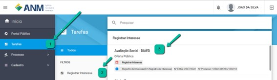
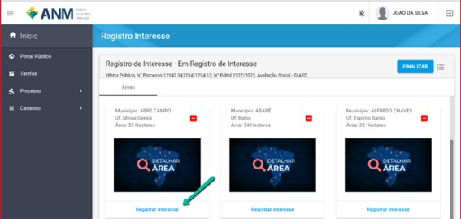
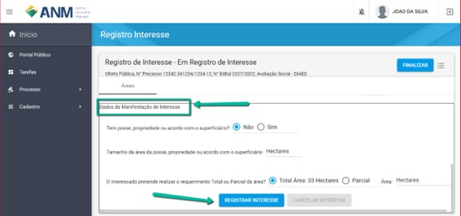
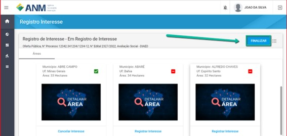
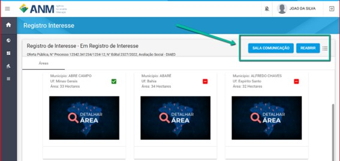

Como registrar interesse numa área em Edital para PLG?
======================================================

Passo 1

Acesse o menu Tarefas >> Filtro "Registro de Interesse" >> Selecione o Edital de Avaliação Social da 6.a Rodada de PLG, conforme imagem abaixo. 
   

Passo 2 
Na Funcionalidade de Registro de Interesse, busque pelas áreas de seu interesse e clique em "Registrar Interesse", conforme imagem a seguir.  

Informe os dados da Manifestação de Interesse que serão utilizados para avaliação social, tamanho da área da posse Propriedade ou acordo com o superficiário e caso seja o ganhador da área informe se pretende realizar o requerimento total, ou parcial, caso parcial, informe o tamanho da área que será requerida. Conforme imagem a seguir.

IMPORTANTE: Lembre-se de clicar em FINALIZAR a Manifestação de Interesse depois de registrar interesse. Apenas Manifestações de interesse finalizadas são consideradas válidas para fins de participação. Conforme imagem a seguir. 

Caso queira informar a sua manifestação de interesse para incluir novos registros de interesse em áreas ou retirar o registro de interesse em áreas, utiliza a funcionalidade de Reabrir a Manifestação de interesse, conforme imagem a seguir.  

IMPORTANTE: Caso utilize a funcionalidade de Reabrir, lembre-se de Finalizar a Manifestação de interesse novamente. 
